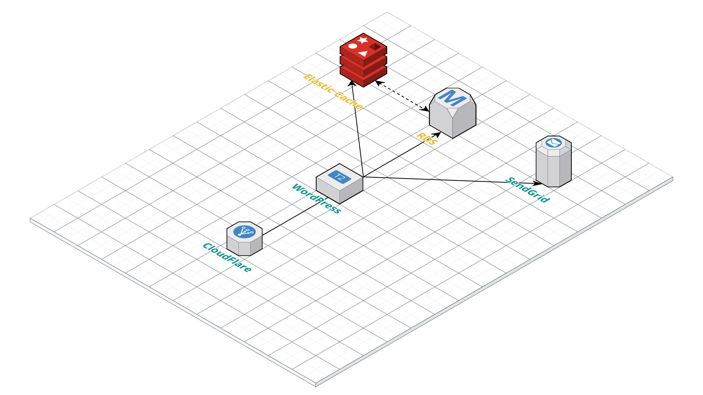

# 第1章: Capital PのAWS構成

さて、GCPに移行するより先に、現在のCapital Pがどんな構成のWebサイトとなっているのかを説明しよう。Capital PのURLは`https://capitalp.jp`である。ホスティングにはAWSを利用しており、以下のサービスが動いている。

### EC2

Webサーバとして動作している。プランは`t2.micro`と控えめ。月額1,000円ぐらい。そんなにアクセスが多いサイトではないので、これでも十分である。

### RDS

データベースはRDSを利用している。プランは`db.t2.micro`で、もちろん[Aurora]()による冗長化はしていないのだが、月額1,500〜2,000円程度とややお高め。

### ElasticCache

WordPressに存在するオブジェクトキャッシュ機構を利用するため、[ElastiCache](https://aws.amazon.com/jp/elasticache/)を利用している。Capital Pのためだけに使っているわけではないのだが、こちらも2,000円弱とややお高め。

### SendGrid

メールサーバーは[SendGrid](https://sendgrid.kke.co.jp)の無料プランを利用している。利用しているプラグインは[Hamail](https://github.com/hametuha/hamail) といって、筆者が作成したプラグイン。WordPressから送られるすべてのメールがSendgrid経由になる。一応、SES + S3 + Lambdaを組み合わせて受信用メールサーバーも立てているのだが、これはほとんど使われないので割愛。

### CloudFlare

CDNサービスとして[CloudFlare](https://www.cloudflare.com)の無料プランを使っている。通常のCDNおよびDNSサーバーとして利用している。Capital Pではポッドキャストも配信しているので、mp3ファイルの配信にはCDNが欠かせない。

=============

概念図を以下に示すので、参考にしていただきたい。

##  総合経費

その他、ポッドキャスト配信に利用しているZencastrというサービスに月20ドルかかっている。

したがって、サービス利用料は**月額7,000円**ぐらいである。この規模のWebサイトとしてはちょっとかかりすぎだが、幸いAdsenseの広告費だけで十分まかなえている。

GCPに以降するにあたっては、なんとかこの予算以下に収めたいところだ。
