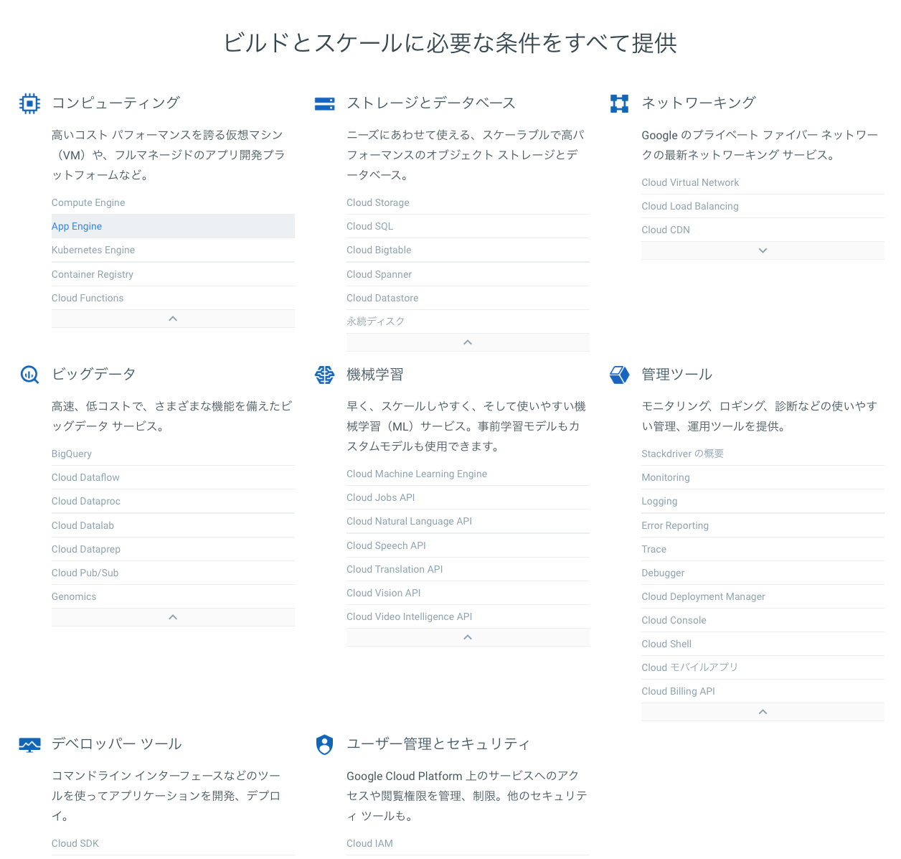

# 2章: GCP アプリケーションの紹介

さて、現状のCapital PのAWS構成を整理し終わったところで、移行先であるGCPのサービスをいったん整理してみよう。

GCPの[サービストップページ](https://cloud.google.com/?hl=ja)に移動すると、非常に多岐にわたる紹介を得ることができる。

これらのサービスそれぞれを把握するだけでも立派なクラウドエンジニアになれようというものだ。「異常にサービスが多く、それを把握するだけでも大変」というのはAWSと同じ状況であり、すでに[パートナー認定制度](https://cloud.google.com/partners/join/?hl=ja)が存在している。そのうち[AWSのような資格試験](https://aws.amazon.com/jp/certification/)も提供されるかもしれない。

## 必要な技術の把握

まずはWordPressをホスティングするにあたって必要な技術を把握しよう。

### Webサーバー

まずはPHPが動作するWebサーバーである。要するに、ApacheもしくはNginx+PHP-FPMが動けばWordPressが動作する。これを実現するためのサービスは以下の3つ。

- Compute Engine
- App Engine
- Kubernetes Engine

上記3つはすべて仮想マシンだが、使い方が異なるので、それぞれ章を割いて説明しよう。また、GCPで汎用的に使われる概念として、「コンテナ」というものがあるのだが、これも次章以降で説明するので、念頭に置いておいてほしい。

### ディスク

仮装マシンを使うクラウドサービスでは、レンタルサーバーやVPSとは異なり、「消えないディスク」を保存するためのサービスを利用することが普通だ。GCPにはその名もズバリ[永続ディスク](https://cloud.google.com/persistent-disk/?hl=ja)という機能がある。

「永続」というとなんだか大袈裟に聞こえるが、これは対義語として「揮発性」という概念を知っておくとよいだろう。揮発性とは要するにメモリ上にだけ存在するデータのことで、こうしたデータはマシンのシャットダウンとともに消えてしまうのが普通だ。キャッシュなどの一時的なデータは揮発性ディスクに、アップロードした画像などの「コンテンツ」は永続ディスクに、というのが正しい使い分けである。

WordPressの場合はWordPressディレクトリをそのまま永続ディスクにまるっと入れるのが正しいやり方だろう。

### データベース

WordPressはMySQLで動作するので、それと互換性のあるデータベースが必要だ。GCPには[Cloud SQL](https://cloud.google.com/sql/?hl=ja)というサービスがあり、これはAWSでいうところのRDSにあたる。MySQLだけが単体のサービスとして存在していると考えればよい。

### ネットワーキング

Webサーバー、ディスク、データベースがあればWordPressは動作するが、それをWeb上に公開するとなると、ネットワークに関するサービスを利用しなければならない。

#### IPアドレス VS ロードバランサー

まずはインターネット上でアクセスできるようにするための仕組みについて。

レンタルサーバーなどではあまり意識することはないのだが、これにも料金が発生する。一台構成ならグローバルIPアドレスの割り当て、複数台構成ならロードバランサーをエンドポイントにするのが普通だ。

AWSでは[Elastic Load Balancing](https://aws.amazon.com/jp/elasticloadbalancing/)というサービスがあるのだが、このロードバランサーが結構高い。何も考えずに一台借りると、月額で大体2,000円弱かかる。これはGCPの[Google Cloud Load Balancing](https://cloud.google.com/load-balancing/?hl=ja)でもあまり変わらないようだ。

負荷分散のための複数台構成についても取り上げるが、まずはお金をかけずにIPアドレスの割り当てを行う。GCPには[静的外部IPアドレス](https://cloud.google.com/compute/docs/ip-addresses/reserve-static-external-ip-address?hl=ja)というものが存在するので、それを利用すればよいだろう。

#### DNS

DNSはドメインをIPアドレスに変換する仕組みだ。これがないと、 `https://capitalp.jp` と入力した時に、どのネットワークに接続すれがよいのかがわからなくなってしまう。

通常、レンタルサーバーなどではDNSもセットになっていたり、ドメイン販売業者自体がDNSをついでに提供していたりするので、あまり気にすることはないだろう。Captal PもCloudFlareに付属しているDNSを利用しているので、おそらく使わないだろう。

GCPにも[Cloud DNS](https://cloud.google.com/dns/?hl=ja)というサービスが存在する。AWSの[Route 53](https://aws.amazon.com/jp/route53/)同様、料金はとても安いので、ほとんど意識せずに使うことができるはずだ。

### メールサーバー

さて、これはWordPressの問題といえるのかわからないが、AWSにある[SES](https://aws.amazon.com/jp/ses/)というメール送信サービスにあたるものが[存在せず](https://cloud.google.com/compute/docs/tutorials/sending-mail/?hl=ja)、インスタンスからのメール送信も「デフォルトでブロック」されているようだ。SendGridやMailgunなどのサードパーティーツールもしくはG Suiteによるメール送信を推奨している。

Capital Pではたまたま筆者が作った[hamail](https://github.com/hametuha/hamail)というSendGrid経由でメールを送信するプラグインを利用しているので問題はないのだが、これは一つハマりポイントである。

問題は受信をどうするか、である。Capital Pでは一応メールアドレスを利用しているので、この受け取りをどうするか。G Suiteは利用者あたりで課金されるため、Capital PのためだけにG Suiteを申し込むのは現実的ではない。となると、残念ながらメールの受信に関してはSESを使い続けざるを得ないようだ。

### キャッシュサーバー

これは必須ではないのだが、WordPressの[オブジェクトキャッシュ機能](https://wpdocs.osdn.jp/%E3%82%AF%E3%83%A9%E3%82%B9%E3%83%AA%E3%83%95%E3%82%A1%E3%83%AC%E3%83%B3%E3%82%B9/WP_Object_Cache)を使うにあたり、MemcachedやRedisのようなインメモリデータベースをキャッシュサーバーとして使うと、かなりの高速化が期待できるし、そのためのプラグインも存在している。

ただし、[Amazon ElasticCache](https://aws.amazon.com/jp/elasticache/)のようなキャッシュサーバーサービスはGCPに存在しないようだ。これは移行作業を行いながら代替案を探すことを試みたい。

====================

さて、以上をもって移行のために必要な知識は手に入った。以下、GCPのサービスのうち、興味深そうなものをざっと取り上げよう。

## GCPのその他の技術

GCPは「Webサイトのクラウドホスティング」というだけでなく、クラウド・コンピューティングサービスとして様々な機能を持つ。そのうち興味深いものをいくつか紹介しよう。

これらの機能はGCEのインスタンスから容易に操作できることが想定されるので、もしWordPressとこれらの機能を組み合わせたなにかを作りたいというのであれば、GCPでのホスティングは最良の選択肢の一つになるだろう。

### サーバーレス

AWSには[Lambda](http://aws.amazon.com/jp/lambda/)というサーバーレス機能がある。これはなんらかのデプロイメントを施すことなく、nodeなりpythonなりで書かれた関数が必ず動くことを保証するクラウドサービスだ。実行時にだけ課金されるという独自の料金体系でも注目の技術の一つである。GCPにも[Cloud Functions](https://cloud.google.com/functions/?hl=ja)が存在しており、Node.jsがそのまま動くというシンプルな作りだ。ちょっと癖のあるAWS Lambdaよりは使いやすいのではないかと、筆者はひそかに期待している。

### ビッグデータ解析

たとえば、[Google BigQuery]()のようなビッグデータ解析用プラットフォームなど。AWSでは[RedShift](https://aws.amazon.com/jp/redshift/)というサービスがある。筆者はどちらも利用経験がないのだが、スマホアプリゲーム開発の現場では、ユーザーの利用状況測定に使われたりするらしいので、そういう使い方もできる。他にも[Google Cloud Pub/Sub](https://cloud.google.com/pubsub/?hl=ja)のようなイベント駆動型分析・配信ツールなどがある。

### 機械学習

Googleは機械学習のジャンルでたびたび画期的な論文やサービスを発表している。棋で人類を打ち破ったAlphaGoもGoogle参加の企業だ。筆者は門外漢だが、なんとなくAmazonやAppleよりもGoogleに一日の長があるような気がする。

機械学習用のリソースをまるっと提供してくれる[Cloud Machine Learning Engine](https://cloud.google.com/ml-engine/?hl=ja)もさることながら、求職者と仕事をマッチングさせるサービス、画像分析などなど、ユニークなものも多い。

WordPressとの連携を行う場合、翻訳やテキスト分析、音声合成などが魅力的なサービスを作りやすいだろう。筆者は自分のブログのタイトルをわかちがきにするため、[Google Cloud Natural Language API](https://cloud.google.com/natural-language/?hl=ja)を利用している。興味のある方は筆者の作ったサイト [Let's Punctuate!](https://punctuate.space) をご覧いただきたい。

### 管理用ツール

ロギング、監視などといった補助ツールのほか、ユーザーの権限を管理するためのIAMも提供される。受託請負などでもある程度の柔軟な管理権限が可能だ。ただし、ロール（役割）が多岐にわたるので、しっかりと理解して使うにはかなりの経験が必要だ。

## まとめ

いったんまとめよう。GCPは先発のAWSほどではないが様々なサービスを提供しており、申し分のないサービスといえるだろう。料金についてはどのクラウドも複雑なので、「よくわらからない」というのが正直な気持ちだ。とりあえず移行してみて実際の感想をお届けするのが一番だろう。次章以降でいよいよ移行を開始する。