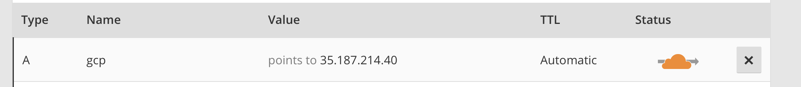

# 3章: Google Compute EngineによるシングルWordPress

それでは早速既存のCapital Pサイトを移行しよう。まずはプロジェクトを作成する。GCPのコンソール画面に入ったら、ロゴの横にあるProjectをクリックすると、プロジェクトを作成することができる。


プロジェクトを作成したら左上のハンバーガーメニューからCompute Engineを選択し、「VMインスタンス」を選ぶ。VMはVirtual Machine（仮想マシン）の略だろう。課金を有効にしていない場合は追加できないので、「お支払い」からクレジットカード番号を登録して課金を有効にしよう。

設定項目は次の通り。

| 項目 | 値 | 備考 |
| ---- | --- | ---- |
| 名前 | capitalp-web-single | |
| ゾーン | asia-northeast1-b | northeastが東京らしい |
| マシンタイプ | g1-small | AWSのt2.microよりちょっと上。同等のものがなかったため。 |
| ブートディスク | CentOS 7 標準ディスク 10GB ||
| ファイアウォール | HTTPSトラフィックを許可する | |
| ネットワーキング | 外部IPを作成 | |


この後、無事作成された。さらに、VMの起動が終わると、コンソールに表示され、「SSH」をクリックするとブラウザでシェルが立ち上がる。


AWSの場合はいちいち鍵をダウンロードしたりしていたので、これはずいぶん楽だ。


さて、今回与えられたIPアドレスは `35.187.214.40` である。Caiptal Pのドメイン `gcp.capitalp.jp` を使ってこのアドレスにアクセスできるように設定してみよう。ここからはAWSのEC2でやったのと似たような処理が必要になる。

## rootになる

`sudo` コマンドはパスワードがわからなくて使えなかったのだが、rootになることはできるようだ。

```
sudo su -
```

上記コマンドでrootユーザーになることができる。IAMを使うと色々できるはずなのだが、まだよくわからないので、そのまま。

## SWAP領域の確保

EC2の安いインスタンスでも同様に必要な作業なのだが、こうした仮想マシンではSWAP領域が確保されていないので、メモリを使い切った瞬間にマシンがハングアップする。これを防ぐためにはSWAP領域を確保する必要がある。詳細はブログ記事「[AWS Amazon Linux スワップファイル作成によりSwap領域のサイズを増やす](https://qiita.com/na0AaooQ/items/278a11ed905995bd16af)」などを参照のこと。

```
dd if=/dev/zero of=/swapfile1 bs=1M count=2048
chmod 600 /swapfile1
mkswap /swapfile1
swapon /swapfile1
free
              total        used        free      shared  buff/cache   available
Mem:        1737064      161064       78768        8484     1497232     1384044
Swap:       2097148           0     2097148
```

これで2GBのSWAP領域（そんないるかはしらないが）が確保された。続いて、この設定がマシンの起動のたびに有効になるようにする。

```
vi /etc/fstab
# 以下の行を追記
/swapfile1  swap        swap    defaults 0 0
# 再起動
sudo reboot
```

## nginxのインストール

とりあえず、ネットワーク上で動作するかどうかを確かめたいので、nginxのインストール&起動を試みよう。ここから先はEC2とほぼ同じなのだが、WordPressを入れるよりも前に、次の条件を満たすサーバーを立て、疎通確認とする。

- nginxでSSL接続が有効なWebサーバーを立てる
- 適当なファイルを配置し、動作を確認する
- CloudFlareのDNSで `gcp.capitalp.jp` のレコードをIPアドレス `35.187.214.40 ` に向ける
- `https://gcp.capitalp.jp/` が表示されることを確認する。

まずはCloudFlareでのサブドメイン設定から。これでひとまずアクセスはできるはずだ。



続いて、nginxをインストールし、ファイルを配置する。

```
# インストール
sudo yum install nginx -y
# 自動起動設定
sudo systemctl enable nginx
# 起動
sudo systemctl start nginx
# 確認
ps aux | grep nginx
```

さて、これで接続確認といこう。


念のため補足しておくが、Capital Pはやや特殊な運用をしており、CloudFlareの[Flexible SSL](https://support.cloudflare.com/hc/en-us/articles/200170416-What-do-the-SSL-options-Off-Flexible-SSL-Full-SSL-Full-SSL-Strict-mean-)という機能を利用している。これはCloudFlareが接続先のWebサーバーにSSLがあろうがなかろうがポート80（http）で接続し、代理で証明書を発行してくれるという仕組みだ。よって、Capital PではnginxのデフォルトインストールでもSSLが適用されているというわけである。さくらインターネットのSNIも似たような仕組みだ。

なにはともあれ、これで接続は完了した。続いて、WordPressをインストールするために、PHP+MySQLの準備をしよう。

## PHP-FPMのインストール

PHP-FPMのインストール自体はそれほど難しくない。が、選んだディストリビューションがCentOSだったので、remiというリポジトリを入れないとPHP7が入らない。ubuntuなら特に何もしなくてもPHP7が入るはずだ。

```
# remiをインストール
sudo yum -y install http://rpms.famillecollet.com/enterprise/remi-release-7.rpm
# remiを有効化
sudo vim /etc/yum.repos.d/remi-php72.repo
[remi]
...
- enabled=0
+ enabled=1
# PHP7.2をインストール
sudo yum install php72 php72-php-fpm php72-php-gd php72-php-mbstring php72-php-mysqlnd php72-php-opcache
# シンボリックリンクを貼る。この作業はubuntuでは不要。
sudo ln -s /usr/bin/php72 /usr/bin/php
# インストール確認
php -v
PHP 7.2.4 (cli) (built: Mar 27 2018 16:16:09) ( NTS )
# 設定ファイルの確認（remiの場合は場所が変わる）
php -i | grep php.ini
Configuration File (php.ini) Path => /etc/opt/remi/php72
Loaded Configuration File => /etc/opt/remi/php72/php.ini
```

今回は`/etc/opt/remi/php72`に設定ファイルが存在するようだ。まずは簡単な設定を行っておこう。PHPの設定ファイル`php.ini`から。

```
sudo vim /etc/opt/remi/php72/php.ini
# タイムゾーン設定
date.timezone = Asia/Tokyo
# Capital Pではポッドキャスト配信があるので、アップロードサイズを変更
upload_max_filesize = 100M
post_max_size = l00M
```

続いて、PHP-FPMの設定ファイルである`php-fpm.d/www.conf`を編集する。

```
sudo vim /etc/opt/remi/php72/php-fpm.d/www.conf
# 初期値だとメモリをバカぐいして落ちるので、プロセス数を控えめに。
pm.max_children = 5
pm.start_servers = 1
pm.min_spare_servers = 1
pm.max_spare_servers = 4
```

それでは、サービスを登録しよう。

```
sudo systemctl start php72-php-fpm
sudo systemctl enable php72-php-fpm
```

続いて、nginxからPHP-FPMに処理を渡すために、設定ファイルを追加する。

```
sudo vim /etc/nginx/conf.d/php-fpm.conf
# 以下の記載で、PHP-FPM用のアップストリームを登録
upstream php-fpm {
        server 127.0.0.1:9000;
}
```

さらに、nginxがphpファイルを処理できるよう、`location`ブロックを追加しよう。インストール時デフォルトの`server`ブロック内部に書く。

```
sudo vim /etc/nginx/nginx.conf
# 以下はデフォルトのserverブロック
 # Bypass to PHP-FPM.
location ~ \.php$ {
    fastcgi_pass   php-fpm; #see upstream
    fastcgi_index  index.php;
    fastcgi_read_timeout 120;
    fastcgi_connect_timeout 120;
    fastcgi_send_timeout 120;
    fastcgi_param  SCRIPT_FILENAME  $document_root$fastcgi_script_name;
    fastcgi_buffer_size 128k;
    fastcgi_buffers 4 256k;
    fastcgi_busy_buffers_size 256k;
    fastcgi_temp_file_write_size 256k;
    include        fastcgi_params;
}
```

それでは、`sudo nginx -t`で設定ファイルに誤りがないかを確認したら、nginxを`sudo systemctl restart nginx`で再起動しよう。これでPHPが動作するようになっているはずなので、以下に記載するような簡単なPHPファイル`test.php`をnginxのデフォルトドキュメントルートである`/usr/share/nginx/html/`に配置し、`gcp.capitalp.jp/test.php`にアクセスして情報が表示されるかを確認する。

```
<?php phpinfo();
```


あとはWordPressのためのドキュメントルートを設定すれば完了なのだが、ではこれをどこにすべきだろうか？

この問題については次節以降を参考にしてほしい。

## WordPressディレクトリの設計

GCPに限らずクラウドホスティングを利用する場合、スケーラブルな構成を目指すことが重要である。とりわけ、エンタープライズレベルの利用法を目指すのであれば、ぜひとも身につけておきたい知識の一つだ。

さて、WordPressはそれ自体がファイルの書き換えを行う仕組みを持っている。

- WordPressコアのアップデート
- プラグイン・テーマなどのサードパーティーによるアップデート
- ユーザーによるメディアファイルのアップロード

上記のタイミングでファイルが追加・削除・更新される。したがって、クラウドでスケーラブルな構成にするには、WordPressのルートディレクトリが複数のWebサーバーから接続でき、常にその構成の正しさが担保されていなければならない。AWSでのよくあるパターンとしては、NFS(Network File System)にWordPressを配置するような手法が取られる。


[lsyncd](https://github.com/axkibe/lsyncd)などでサーバー間のファイルシステムを同期するパターンもありえるが、新規プラグイン追加時やWordPressコアアップデート時の負荷が大きいこと、そして、膨大なトラフィックがあるサイトでのデバッグが困難なことを考えると、単一のファイルシステム自体を参照した方が、間違いが少ない。

ただし、この構成にも問題点はあり、それはNFSがSPOF(Single Point Of Failure)つまり、単一障害点になってしまうことだ。WordPressディレクトリを配置しているNFSサーバーが死んでしまった場合、すべてのWebサーバーが元気に稼働していても、サイトは落ちてしまう。

これに対するソリューションとして、AWSでは長らく[ElasticFileSystem](https://aws.amazon.com/jp/efs)というサービスが予告されていたが、ベータ版の期間が長く、正式リリースされた現在（2018年3月）でもまだ東京リージョンは存在していない。したがって、筆者などはエンタープライズレベルの顧客に対してはNFSのバックアップサーバーを用意し、障害があった場合はそれを入れ替えるという構成にしていた。これはこれで**NFSのお守り**が必要となり、「せっかくクラウドを利用しているのに……」という虚しさを感じていたものだ。

しかしながら、GCPの[永続ディスク](https://cloud.google.com/persistent-disk/?hl=ja)はこうしたNFS的な性質を標準装備しているらしい。耐障害性も永続ディスク単体で保証しているようで、AWSの[Elastic Block Store](https://aws.amazon.com/jp/ebs/)と異なり、一つのインスタンスにしか紐づけられないという制約はなさそうだ。いうことは、WordPressディレクトリをこの永続ディスクに入れておき、なおかつそのディスクを複数のインスタンスで共有すれば、単一障害点なしでスケーラブルな構成を手に入れることができる。容量の追加もクラウド上で[簡単にできる](https://cloud.google.com/compute/docs/disks/add-persistent-disk?hl=ja)らしい。

> 永続ディスクは独自のマルチリーダー機能を備えています。マルチリーダー機能を搭載することで、処理速度を低下させることなく、1 枚の永続ディスクのデータを複数の仮想マシンが同時に読み取ることができます。マルチリーダー機能により、コンテンツの共有がとても簡単になりました。

ポイントとしては、VMインスタンスを立ち上げたときにおまけで付いてくる永続ディスクとは別のディスクを用意すること。VMにはブートディスク（OSが入ったディスク）が必要になるのだが、それとはあえて別のディスクを用意することで共有が簡単になる。料金はSSDでも1GB/1ヶ月で$0.221（2018年3月現在）と安いので、費用の心配をする必要はないだろう。

それでは、実際にやってみよう。まずは永続ディスクの作成から。コンソールで__Compute Engine > ディスク > ディスクを作成__をクリックする。


設定画面は次の通り。必要かどうかはわからないが、VMインスタンスとゾーンをあわせておいた方がいいだろう。今回は`asia-northeast1-b`とする。


さて、ではこのディスクをVM`capitalp-web-single`にマウントするにはどうしたらよいのだろうか。[ドキュメント](https://cloud.google.com/compute/docs/disks/add-persistent-disk?hl=ja)によれば、最初にアタッチしたあとにフォーマットが必要なようだが、それほど難しい作業ではなさそうだ。


フォーマットの手順はドキュメントにあるのだが、コマンドラインでの操作が必要な様子。コンソールからターミナルを立ち上げ、次のような処理を行う。

```
# 接続しているディスクを確認
sudo lsblk
NAME   MAJ:MIN RM SIZE RO TYPE MOUNTPOINT
sda      8:0    0  10G  0 disk 
└─sda1   8:1    0  10G  0 part /
sdb      8:16   0  10G  0 disk
# sdbが新しい永続ディスクなので、これをフォーマット。
# もし違う名前だった場合は最後の引数を/vdev/[device_id]とする
sudo mkfs.ext4 -m 0 -F -E lazy_itable_init=0,lazy_journal_init=0,discard 
/dev/sdb
# マウントするディレクトリを作成
sudo mkdir -p /var/www/wordpress
# マウント
sudo mount -o discard,defaults /dev/sdb /var/www/wordpress/
# マウントしたディスクへの書き込み権限を付与
sudo chmod a+w /var/www/wordpress/
# マウントしたディスクのUUIDを調べる
sudo blkid /dev/sdb
/dev/sdb: UUID="9d641616-bc2e-4cd1-9ffe-cac34a5fc414" TYPE="ext4" 
# UUIDがわかったので、fstabに記載し、起動時に自動でマウントされるようにする
# /etc/fstabを編集する
sudo vim /etc/fstab
# 以下の1行を追記
UUID=9d641616-bc2e-4cd1-9ffe-cac34a5fc414 /var/www/wordpress      ext4    discard,defaults,nofail 0 2
```

きちんとマウントされたかどうかを確かめるために、`/var/www/wordpress`に先ほど作成した`test.php`を移動してみよう。

```
# 移動
mv /usr/share/nginx/html/test.php /var/www/wordpress
# 再起動
sudo reboot
# 再接続ののち、ディスクを表示
sudo lsblk
NAME   MAJ:MIN RM SIZE RO TYPE MOUNTPOINT
sda      8:0    0  10G  0 disk 
└─sda1   8:1    0  10G  0 part /
sdb      8:16   0  10G  0 disk /var/www/wordpress
```

これでマウントできたようだ。では、ここにCapital PのWordPressディレクトリをまるっとコピーしよう。

```
# Capital Pの現在のサーバーにログイン
ssh capitalp.jp
# WordPressディレクトリを固める
cd /var/www
sudo tar cvf wordpress.tar.gz wordpress/
# 公開領域に移動
sudo mv wordpress.tar.gz wordpress/wp-content/
```

サイト全体を公開領域に上げてしまったのだが、すぐに削除するので問題ないだろう。

```
# GCPのターミナルでの作業
# いったんホームディレクトリに一時フォルダを作成
cd ~
mkdir tmp
cd tmp
# wgetが入っていない（！）ので、インストール
sudo yum install -y wget
# ダウンロード。完了後、すみやかに元サーバーのファイルは消すように。
wget https://capitalp.jp/wp-content/wordpress.tar.gz
# 解答
tar xzf wordpresss.tar.gz
# すべてを先ほど作成したディレクトリにコピー
cp -r wordpress/* /var/www/wordpress
```

これでファイルの準備を整った。あとはnginxの設定を変更するだけだ。デフォルトの設定だと、nginxのドキュメントルートは`/usr/share/nginx/html`だったが、これを`/var/www/wordpress`に変更しよう。

```
sudo vim /etc/nginx/nginx.conf
# serverブロックを次のように編集
root         /var/www/wordpress;
# nginxを再起動
sudo systemctl restart nginx
```

これで準備はできた。まだデータベースの設定は動かないが、htmlなら表示できるはず。`gcp.capitalp.jp/readme.html`にアクセスし、設定が有効かどうか、確かめてみよう。


もちろん、ルートディレクトリにアクセスしようとすると、データベース接続エラーが発生する。残す作業はあと一つ、RDSで管理していたデータベースの移行である。

## データベース

