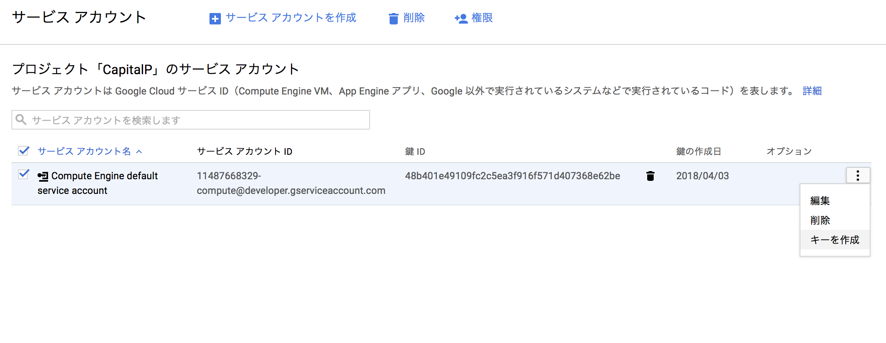
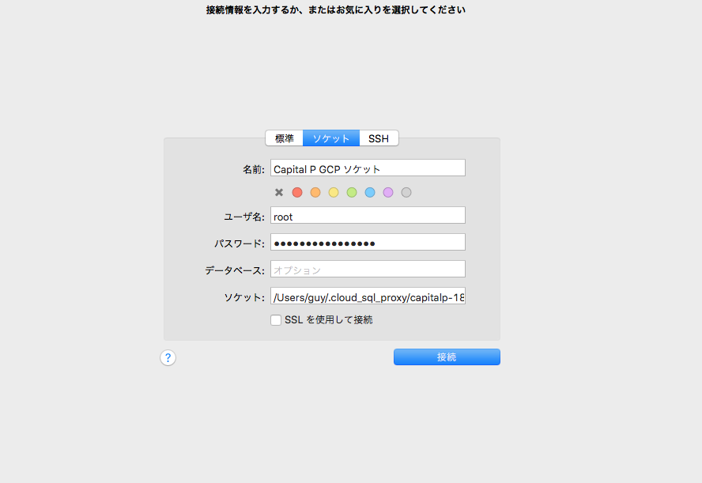

# 3章: Google Compute EngineによるシングルWordPress

高橋文樹

それでは早速既存のCapital Pサイトを移行しよう。まずはプロジェクトを作成する。GCPのコンソール画面に入ったら、ロゴの横にあるProjectをクリックすると、プロジェクトを作成することができる。


プロジェクトを作成したら左上のハンバーガーメニューからCompute Engineを選択し、「VMインスタンス」を選ぶ。VMはVirtual Machine（仮想マシン）の略だろう。課金を有効にしていない場合は追加できないので、「お支払い」からクレジットカード番号を登録して課金を有効にしよう。

設定項目は次の通り。

| 項目 | 値 | 備考 |
| ---- | --- | ---- |
| 名前 | capitalp-web-single | |
| ゾーン | asia-northeast1-b | northeastが東京らしい |
| マシンタイプ | g1-small | AWSのt2.microよりちょっと上。同等のものがなかったため。 |
| ブートディスク | CentOS 7 標準ディスク 10GB ||
| ファイアウォール | HTTPSトラフィックを許可する | |
| ネットワーキング | 外部IPを作成 | |


この後、無事作成された。さらに、VMの起動が終わると、コンソールに表示され、「SSH」をクリックするとブラウザでシェルが立ち上がる。


AWSの場合はいちいち鍵をダウンロードしたりしていたので、これはずいぶん楽だ。


さて、今回与えられたIPアドレスは `35.187.214.40` である。Caiptal Pのドメイン `gcp.capitalp.jp` を使ってこのアドレスにアクセスできるように設定してみよう。ここからはAWSのEC2でやったのと似たような処理が必要になる。

## rootになる

`sudo` コマンドはパスワードがわからなくて使えなかったのだが、rootになることはできるようだ。

```
sudo su -
```

上記コマンドでrootユーザーになることができる。IAMを使うと色々できるはずなのだが、まだよくわからないので、そのまま。

## SWAP領域の確保

EC2の安いインスタンスでも同様に必要な作業なのだが、こうした仮想マシンではSWAP領域が確保されていないので、メモリを使い切った瞬間にマシンがハングアップする。これを防ぐためにはSWAP領域を確保する必要がある。詳細はブログ記事「[AWS Amazon Linux スワップファイル作成によりSwap領域のサイズを増やす](https://qiita.com/na0AaooQ/items/278a11ed905995bd16af)」などを参照のこと。

```
dd if=/dev/zero of=/swapfile1 bs=1M count=2048
chmod 600 /swapfile1
mkswap /swapfile1
swapon /swapfile1
free
              total        used        free      shared  buff/cache   available
Mem:        1737064      161064       78768        8484     1497232     1384044
Swap:       2097148           0     2097148
```

これで2GBのSWAP領域（そんないるかはしらないが）が確保された。続いて、この設定がマシンの起動のたびに有効になるようにする。

```
vi /etc/fstab
# 以下の行を追記
/swapfile1  swap        swap    defaults 0 0
# 再起動
sudo reboot
```

## nginxのインストール

とりあえず、ネットワーク上で動作するかどうかを確かめたいので、nginxのインストール&起動を試みよう。ここから先はEC2とほぼ同じなのだが、WordPressを入れるよりも前に、次の条件を満たすサーバーを立て、疎通確認とする。

- nginxでSSL接続が有効なWebサーバーを立てる
- 適当なファイルを配置し、動作を確認する
- CloudFlareのDNSで `gcp.capitalp.jp` のレコードをIPアドレス `35.187.214.40 ` に向ける
- `https://gcp.capitalp.jp/` が表示されることを確認する。

まずはCloudFlareでのサブドメイン設定から。これでひとまずアクセスはできるはずだ。


続いて、nginxをインストールし、ファイルを配置する。

```
# インストール
sudo yum install nginx -y
# 自動起動設定
sudo systemctl enable nginx
# 起動
sudo systemctl start nginx
# 確認
ps aux | grep nginx
```

さて、これで接続確認といこう。


念のため補足しておくが、Capital Pはやや特殊な運用をしており、CloudFlareの[Flexible SSL](https://support.cloudflare.com/hc/en-us/articles/200170416-What-do-the-SSL-options-Off-Flexible-SSL-Full-SSL-Full-SSL-Strict-mean-)という機能を利用している。これはCloudFlareが接続先のWebサーバーにSSLがあろうがなかろうがポート80（http）で接続し、代理で証明書を発行してくれるという仕組みだ。よって、Capital PではnginxのデフォルトインストールでもSSLが適用されているというわけである。さくらインターネットのSNIも似たような仕組みだ。

なにはともあれ、これで接続は完了した。続いて、WordPressをインストールするために、PHP+MySQLの準備をしよう。

## PHP-FPMのインストール

PHP-FPMのインストール自体はそれほど難しくない。が、選んだディストリビューションがCentOSだったので、remiというリポジトリを入れないとPHP7が入らない。ubuntuなら特に何もしなくてもPHP7が入るはずだ。

```
# remiをインストール
sudo yum -y install http://rpms.famillecollet.com/enterprise/remi-release-7.rpm
# remiを有効化
sudo vim /etc/yum.repos.d/remi-php72.repo
[remi]
...
- enabled=0
+ enabled=1
# PHP7.2をインストール
sudo yum install php72 php72-php-fpm php72-php-gd php72-php-mbstring php72-php-mysqlnd php72-php-opcache
# シンボリックリンクを貼る。この作業はubuntuでは不要。
sudo ln -s /usr/bin/php72 /usr/bin/php
# インストール確認
php -v
PHP 7.2.4 (cli) (built: Mar 27 2018 16:16:09) ( NTS )
# 設定ファイルの確認（remiの場合は場所が変わる）
php -i | grep php.ini
Configuration File (php.ini) Path => /etc/opt/remi/php72
Loaded Configuration File => /etc/opt/remi/php72/php.ini
```

今回は`/etc/opt/remi/php72`に設定ファイルが存在するようだ。まずは簡単な設定を行っておこう。PHPの設定ファイル`php.ini`から。

```
sudo vim /etc/opt/remi/php72/php.ini
# タイムゾーン設定
date.timezone = Asia/Tokyo
# Capital Pではポッドキャスト配信があるので、アップロードサイズを変更
upload_max_filesize = 100M
post_max_size = l00M
```

続いて、PHP-FPMの設定ファイルである`php-fpm.d/www.conf`を編集する。

```
sudo vim /etc/opt/remi/php72/php-fpm.d/www.conf
# 初期値だとメモリをバカぐいして落ちるので、プロセス数を控えめに。
pm.max_children = 5
pm.start_servers = 1
pm.min_spare_servers = 1
pm.max_spare_servers = 4
```

それでは、サービスを登録しよう。

```
sudo systemctl start php72-php-fpm
sudo systemctl enable php72-php-fpm
```

続いて、nginxからPHP-FPMに処理を渡すために、設定ファイルを追加する。

```
sudo vim /etc/nginx/conf.d/php-fpm.conf
# 以下の記載で、PHP-FPM用のアップストリームを登録
upstream php-fpm {
        server 127.0.0.1:9000;
}
```

さらに、nginxがphpファイルを処理できるよう、`location`ブロックを追加しよう。インストール時デフォルトの`server`ブロック内部に書く。

```
sudo vim /etc/nginx/nginx.conf
# 以下はデフォルトのserverブロック
 # Bypass to PHP-FPM.
location ~ \.php$ {
    fastcgi_pass   php-fpm; #see upstream
    fastcgi_index  index.php;
    fastcgi_read_timeout 120;
    fastcgi_connect_timeout 120;
    fastcgi_send_timeout 120;
    fastcgi_param  SCRIPT_FILENAME  $document_root$fastcgi_script_name;
    fastcgi_buffer_size 128k;
    fastcgi_buffers 4 256k;
    fastcgi_busy_buffers_size 256k;
    fastcgi_temp_file_write_size 256k;
    include        fastcgi_params;
}
```

それでは、`sudo nginx -t`で設定ファイルに誤りがないかを確認したら、nginxを`sudo systemctl restart nginx`で再起動しよう。これでPHPが動作するようになっているはずなので、以下に記載するような簡単なPHPファイル`test.php`をnginxのデフォルトドキュメントルートである`/usr/share/nginx/html/`に配置し、`gcp.capitalp.jp/test.php`にアクセスして情報が表示されるかを確認する。

```
<?php phpinfo();
```


あとはWordPressのためのドキュメントルートを設定すれば完了なのだが、ではこれをどこにすべきだろうか？

この問題については次節以降を参考にしてほしい。

## WordPressディレクトリの設計

GCPに限らずクラウドホスティングを利用する場合、スケーラブルな構成を目指すことが重要である。とりわけ、エンタープライズレベルの利用法を目指すのであれば、ぜひとも身につけておきたい知識の一つだ。

さて、WordPressはそれ自体がファイルの書き換えを行う仕組みを持っている。

- WordPressコアのアップデート
- プラグイン・テーマなどのサードパーティーによるアップデート
- ユーザーによるメディアファイルのアップロード

上記のタイミングでファイルが追加・削除・更新される。したがって、クラウドでスケーラブルな構成にするには、WordPressのルートディレクトリが複数のWebサーバーから接続でき、常にそのディレクトリの一貫性（coinsistency）が担保されていなければならない。AWSでのよくあるパターンとしては、NFS(Network File System)にWordPressを配置するような手法が取られる。


[lsyncd](https://github.com/axkibe/lsyncd)などで複数サーバー間のファイルシステムを同期するパターンもありえるが、新規プラグイン追加時やWordPressコアアップデート時の負荷が大きいこと、そして、膨大なトラフィックがあるサイトでのデバッグが困難なことを考えると、単一のファイルシステム自体を参照した方が、間違いが少ない。

ただし、この構成にも問題点はあり、それはNFSがSPOF(Single Point Of Failure)つまり、単一障害点になってしまうことだ。WordPressディレクトリを配置しているNFSサーバーが死んでしまった場合、すべてのWebサーバーが元気に稼働していても、サイトは落ちてしまう。

これに対するソリューションとして、AWSでは長らく[ElasticFileSystem](https://aws.amazon.com/jp/efs)というサービスが予告されていたが、ベータ版の期間が長く、正式リリースされた現在（2018年3月）でもまだ東京リージョンは存在していない。したがって、筆者などはエンタープライズレベルの顧客に対してはNFSのバックアップサーバーを用意し、障害があった場合はそれを入れ替えるという構成にしていた。これはこれで**NFSのお守り**が必要となり、「せっかくクラウドを利用しているのに……」という虚しさを感じていたものだ。

さて、GCPの[永続ディスク](https://cloud.google.com/persistent-disk/?hl=ja)はこうしたNFS的な性質を標準装備しているかのうような印象を受ける。

> 永続ディスクは独自のマルチリーダー機能を備えています。マルチリーダー機能を搭載することで、処理速度を低下させることなく、1 枚の永続ディスクのデータを複数の仮想マシンが同時に読み取ることができます。マルチリーダー機能により、コンテンツの共有がとても簡単になりました。

AWSの[Elastic Block Store](https://aws.amazon.com/jp/ebs/)と異なり、一つのインスタンスにしか紐づけられないという制約はなさそうなのだが、[永続ディスクの追加またはサイズ変更](https://cloud.google.com/compute/docs/disks/add-persistent-disk#use_multi_instances)というドキュメントを詳細に読むと、同時接続できるのは読み取りモードに限定されるようだ。

> 永続ディスクを複数インスタンスに接続する場合、すべてのインスタンスが永続ディスクを読み取り専用モードで接続する必要があります。複数のインスタンスに読み取り/書き込みモードで永続ディスクを接続することはできません。

WordPressディレクトリをこの永続ディスクに入れておき、なおかつそのディスクを複数のインスタンスで共有すれば、単一障害点なしでスケーラブルな構成を手に入れることができると思ったのだが、そうは問屋が卸さないようだ。公式ドキュメントでは以下の方法を示唆している。

- [Cloud Storageに接続する](https://cloud.google.com/compute/docs/disks/gcs-buckets)
- [NFSを構築する](https://cloud.google.com/solutions/filers-on-compute-engine)
- [Single Node File Serverを構築する](https://cloud.google.com/solutions/filers-on-compute-engine#single-node-file-server)

このうち、Cloud Storageに関しては、マウントした際のファイル読み書きがネットワーク越しになるので、実用に耐える速度が出ないと思われる。Cloud StorageはAWSにおけるS3に相当するサービスだが、以前筆者がS3をマウントするS3FSを利用してWordPress全体を共有してみたところ、堪え難いほど遅かった。

Single Node File ServerはGoogle Cloud Launcherによって提供されるサードパーティーのサービスである。Cloud Launcherとは、要するにGCPの複数のサービスを組み合わせたものをワンクリックで構築できるテンプレートセットのようなものだ。これはこれで便利そうなのだが、コストが高そうなので今回は見送り。残された手段としては、NFSを自力で構築するしかなさそうだ。

とはいえ、永続ディスクそれ自体の利便性はいくつか挙げられる。まず、容量の追加がクラウド上で[簡単にできる](https://cloud.google.com/compute/docs/disks/add-persistent-disk?hl=ja)うえに、ダウンタイムがないそうだ。つまり、10GBで運用をはじめ、画像ファイルが増えてきたらコンソールまたはコマンドラインで容量を追加して終わりだ。容量はなんと最大で64TBまで増加できる。画像が5,000万枚ぐらいになっても耐えられそうだ。耐障害性も永続ディスク単体で保証しており、ディスク自体の健全性について気にする必要はない。

というわけで、残念ながら理想とする高可用性のファイルシステムを簡単に手に入れることはできなかったが、とりあえずファイルシステムとしては永続ディスクを利用することからはじめてみよう。

## 永続ディスクのマウント

それでは、実際にやってみよう。ポイントとしては、VMインスタンスを立ち上げたときにおまけで付いてくる永続ディスクとは別のディスクを用意すること。VMにはブートディスク（OSが入ったディスク）が必要になるのだが、それとはあえて別のディスクを用意することで、あとあと高可用性の環境を構築するのが簡単になる。料金はSSDでも1GB/1ヶ月で0.221ドル（2018年3月現在）と安いので、費用の心配をする必要はないだろう。

まずは永続ディスクの作成から。コンソールで「Compute Engine > ディスク > ディスクを作成」をクリックする。


設定画面は次の通り。必要かどうかはわからないが、VMインスタンスとゾーンをあわせておいた方がいいだろう。今回は`asia-northeast1-b`とする。


さて、ではこのディスクをVM`capitalp-web-single`にマウントするにはどうしたらよいのだろうか。[ドキュメント](https://cloud.google.com/compute/docs/disks/add-persistent-disk?hl=ja)によれば、最初にアタッチしたあとにフォーマットが必要なようだが、それほど難しい作業ではなさそうだ。


フォーマットの手順はドキュメントにあるのだが、コマンドラインでの操作が必要な様子。コンソールからターミナルを立ち上げ、次のような処理を行う。

```
# 接続しているディスクを確認
sudo lsblk
NAME   MAJ:MIN RM SIZE RO TYPE MOUNTPOINT
sda      8:0    0  10G  0 disk 
└─sda1   8:1    0  10G  0 part /
sdb      8:16   0  10G  0 disk
# sdbが新しい永続ディスクなので、これをフォーマット。
# もし違う名前だった場合は最後の引数を/vdev/[device_id]とする
sudo mkfs.ext4 -m 0 -F -E lazy_itable_init=0,lazy_journal_init=0,discard 
/dev/sdb
# マウントするディレクトリを作成
sudo mkdir -p /var/www/wordpress
# マウント
sudo mount -o discard,defaults /dev/sdb /var/www/wordpress/
# マウントしたディスクへの書き込み権限を付与
sudo chmod a+w /var/www/wordpress/
# マウントしたディスクのUUIDを調べる
sudo blkid /dev/sdb
/dev/sdb: UUID="9d641616-bc2e-4cd1-9ffe-cac34a5fc414" TYPE="ext4" 
# UUIDがわかったので、fstabに記載し、起動時に自動でマウントされるようにする
# /etc/fstabを編集する
sudo vim /etc/fstab
# 以下の1行を追記
UUID=9d641616-bc2e-4cd1-9ffe-cac34a5fc414 /var/www/wordpress      ext4    discard,defaults,nofail 0 2
```

きちんとマウントされたかどうかを確かめるために、`/var/www/wordpress`に先ほど作成した`test.php`を移動してみよう。

```
# 移動
mv /usr/share/nginx/html/test.php /var/www/wordpress
# 再起動
sudo reboot
# 再接続ののち、ディスクを表示
sudo lsblk
NAME   MAJ:MIN RM SIZE RO TYPE MOUNTPOINT
sda      8:0    0  10G  0 disk 
└─sda1   8:1    0  10G  0 part /
sdb      8:16   0  10G  0 disk /var/www/wordpress
```

これでマウントできたようだ。では、ここにCapital PのWordPressディレクトリをまるっとコピーしよう。

```
# Capital Pの現在のサーバーにログイン
ssh capitalp.jp
# WordPressディレクトリを固める
cd /var/www
sudo tar cvf wordpress.tar.gz wordpress/
# 公開領域に移動
sudo mv wordpress.tar.gz wordpress/wp-content/
```

サイト全体を公開領域に上げてしまったのだが、すぐに削除するので問題ないだろう。

```
# GCPのターミナルでの作業
# いったんホームディレクトリに一時フォルダを作成
cd ~
mkdir tmp
cd tmp
# wgetが入っていない（！）ので、インストール
sudo yum install -y wget
# ダウンロード。完了後、すみやかに元サーバーのファイルは消すように。
wget https://capitalp.jp/wp-content/wordpress.tar.gz
# 解答
tar xzf wordpresss.tar.gz
# すべてを先ほど作成したディレクトリにコピー
cp -r wordpress/* /var/www/wordpress
```

これでファイルの準備をは整った。あとはnginxの設定を変更するだけだ。デフォルトの設定だと、nginxのドキュメントルートは`/usr/share/nginx/html`だったが、これを`/var/www/wordpress`に変更しよう。

```
sudo vim /etc/nginx/nginx.conf
# serverブロックを次のように編集
root         /var/www/wordpress;
# nginxを再起動
sudo systemctl restart nginx
# PHP-FPMがapacheユーザーで動くので、とりあえずディレクトリ権限をapacheに変更。
sudo chown -R apache:apache /var/www/wordpress
```

これで準備はできた。まだデータベースの設定は動かないが、htmlなら表示できるはず。`gcp.capitalp.jp/readme.html`にアクセスし、設定が有効かどうか、確かめてみよう。


もちろん、ルートディレクトリにアクセスしようとすると、データベース接続エラーが発生する。残す作業はあと一つ、RDSで管理していたデータベースの移行である。

## データベース

GCPでMySQLを利用するには、Cloud SQLインスタンスを作成する必要がある。これもVM同様、新たに作成しよう。左メニューの「SQL」をクリックすることでインスタンス作成ウィザードが立ち上がる。

- データベースエンジンはMySQLを選択
- 第2世代を選択
- リージョンは`asia-northeast1`を、ゾーンは`asia-northeast1-b`を選択。VMに合わせる。
- rootアカウント用のパスワードを生成し、控えておく。
- マシンタイプ（詳細オプションを展開しないと表示されないので注意！）は一番安そうな`db-f1-micro`を選択。
- バックアップを有効化する。東京リージョンで1GBあたり月0.22ドルなので、大した金額にはならないだろう。
- フェイルオーバーレプリカは作成せず。これはおそらく、DBが死んだときのバックアップを作成しておき、障害時にさっと入れ替えるような仕組みだろう。DBのコストが倍になるはずなので、作成せず。
- 「ネットワークの承認」は意味がわからなかったので設定せず。
- メンテナンススケジュールは「おまかせ」にしておく。


設定が終わると、インスタンスの一覧に画像が表示される。はて、WordPressはどうやったらこのMySQLサーバーに接続することができるのだろうか？　AWSでは[VPC](https://aws.amazon.com/jp/vpc/)という概念があり、EC2インスタンス（Webサーバー）とRDS（データベース）を同じVPCネットワークグループに放り込んでおけば、`capitalp.cbmqedvmcaxv.ap-northeast-1.rds.amazonaws.com`のようなURLで接続することができた。VPC外部からの接続はシャットダウンしているので、パスワードが漏れても安心だ。

GCPの場合は[いくつかの接続方法](https://cloud.google.com/sql/docs/mysql/external-connection-methods?hl=ja)があるようだが、どれもそれなりに複雑なようで、一番推奨されているのが[Cloud SQL Proxy](https://cloud.google.com/sql/docs/mysql/connect-compute-engine?hl=ja#gce-connect-proxy)という手法での接続のようである。


ここで重要な概念「サービスアカウント」を説明しておこう。

### サービスアカウントとは？

サービスアカウントはIAMに存在する仮想アカウントである。Googleにおけるアカウントとは、普通メールアドレスを持った実際に存在する人間を思い浮かべるが、GCPのようなクラウドサービスを運営する場合、「メールアドレスとパスワードを持つ仮のユーザー」を作成し、そのアカウントに作業を代行させることが多い。AWSにも同様の仕組みは存在する。要するに、サーバーの擬人化だと考えてもらえばいい。

では、さっそく先ほど作成したVMインスタンスのサービスアカウントの鍵を作成しよう。VM一覧の右端にある「オプション」から「キーを作成」を選ぶと、鍵がダウンロードできる。この鍵は一度しかダウンロードできないので、大事に保管しよう。形式はJSONで構わない。



この鍵をダウンロードすると、なにやらごちゃごちゃと書かれたJSONファイルがダウンロードされる。大事に保存しておこう。今回はSSHの鍵と同様にローカルのMacに`~/.ssh/google/capitalp-ce01.json`として保存した。

### cloud\_sql\_proxyのインストール

さて、まずはローカルのMacから接続してみよう。そのためには、cloud_sql_proxyというツールをインストールしなければならない。まずは[マニュアル通り](https://cloud.google.com/sql/docs/mysql/connect-admin-proxy?hl=ja)に進めてみよう。

```
# ホームフォルダ/binにコマンドをインストール
cd ~/bin
curl -o cloud_sql_proxy https://dl.google.com/cloudsql/cloud_sql_proxy.darwin.amd64
chmod +x cloud_sql_proxy
```

これで`cloud_sql_proxy`と打てばコマンドが実行できる。続いて、UNIXソケット接続を開始しよう。TCPでも接続はできるのだが、筆者はすでにローカルにMySQLをインストールしてしまっているので、ポート3306がバッティングしてしまう。そのため、ソケットファイルで接続するというわけだ。

```
# ホームディテクトリに移動
cd ~
# ソケットファイルの保存場所を作成（不可視フォルダに）
mkdir .cloud_sql_proxy
chmod 777 .cloud_sql_proxy
# 接続を開始
cloud_sql_proxy -dir=.cloud_sql_proxy -instances=capitalp-182517:asia-northeast1:capitalp-db-master -credential_file=.ssh/google/capitalp-ce01.json
```

コマンドの最後に` &`をつけるとデーモン起動になるので、もし必要ならMacの起動時に実行するような設定にしておくといいだろう。

これで準備完了。接続コマンドは以下の通り。もし`mysql`クライアントがインストールされていない場合はしておこう。

```
mysql -u root -p -S ~/.cloud_sql_proxy/capitalp-182517\:asia-northeast1\:capitalp-db-master
```

`-S`オプションでソケットファイルを指定している。たぶんだが、複数のDBインスタンスが存在すれば、その分だけソケットファイルが作られるのだろう。


これで無事接続を確認できた。筆者はCLIが好きではないので、[Sequel Pro](https://www.sequelpro.com)でも接続できるようにしておく。ソケット接続を選択すれば普通に接続できる。



それでは、wordpressというデータベースを作成し、インポートしておこう。あとはWebサーバーから接続できれば完了だ。

### VMインスタンスからの接続

さて、ローカルからの接続はできたので、同じことをVMインスタンスからもやればいいのだろう。ちょっと面倒だが、SSHターミナルを開いて[マニュアル通りに設定](https://cloud.google.com/sql/docs/mysql/connect-compute-engine?hl=ja)を開始しよう。

```
# まずはmysqlのインストール
sudo yum install mysql -y
# cloud_sql_proxyのインストール
cd /usr/local/bin
sudo wget https://dl.google.com/cloudsql/cloud_sql_proxy.linux.amd64 -O cloud_sql_proxy
sudo chmod +x cloud_sql_proxy
# 鍵をインストール
sudo mkdir /cloudsql
# VIMでJSON鍵ファイルをコピペ
sudo vim /cloudsql/capitalp-ce01.json
# TCPでプロキシを開始
cloud_sql_proxy -instances=capitalp-182517:asia-northeast1:capitalp-db-master=tcp:3306 -credential_file=/cloudsql/capitalp-ce01.json
lp-ce01.json &
# 動作を確認
ps aux | grep cloud_sql_proxy
takahas+  7131  0.1  0.2   8060  4228 pts/0    Sl   07:57   0:00 cloud_sql_proxy -instances=capitalp-182517:asia-northeast1:capitalp-db-master=tcp:3306 -credential_
file=/cloudsql/capitalp-ce01.json
# mysqlで接続チェック
mysql -u root -p -h 127.0.0.1
password:
Welcome to the MariaDB monitor.  Commands end with ; or \g.
Your MySQL connection id is 16408
```

さて、それではいよいよWordPressの接続設定を変更し、動作を確認しよう。接続先は`127.0.0.1`である。

```
cd  /var/www/wordpress
sudo vim wp-config.php
```

接続が確認できたかどうかを調べるために、WP-CLIを利用しよう。Linuxの場合、`/usr/local/bin`にインストールすればどのユーザーからも利用できるので、そのようにする。

```
# WP-CLIをインストール
cd /usr/local/bin
sudo curl -O https://raw.githubusercontent.com/wp-cli/builds/gh-pages/phar/wp-cli.phar
sudo mv wp-cli.phar wp
sudo chmod +x wp
# WordPressディレクトリに移動
cd /var/www/wordpress
# データベースの値を取得するコマンド
wp option get home
2018/04/04 08:11:13 New connection for "capitalp-182517:asia-northeast1:capitalp-db-master"
https://capitalp.jp
2018/04/04 08:11:15 Client closed local connection on 127.0.0.1:3306
```

なにやら接続の文字列が出てしまっているが、無事接続はできているようだ。なお、現在は移行中なので、一時的にドメイン名をサブドメインに書換えることも忘れないでおこう。

```
wp search-replace 'https://capitalp.jp' 'https://gcp.capitalp.jp'
```

### 自動起動の設定

VMインスタンスはメンテナンスなどで勝手に再起動されることがある。このため、自動起動を行なっておく必要がある。この情報には公式のドキュメントがなかったので、ブログ記事[GCP Cloud SQLにCloud SQL Proxyで接続しよう。Systemd化してデーモン化！](https://sys-guard.com/post-15640/)を頼りにsystemdによるサービス登録を行う。

```
sudo vim /etc/systemd/system/cloud_sql_proxy.service

[Unit]
Description = Cloud SQL Proxy Daemon
After = network.target

[Service]
ExecStart = /usr/local/bin/cloud_sql_proxy -dir=/cloudsql -instances=capitalp-182517:asia-northeast1:capitalp-db-master=tcp:3306 -credential_file=/cloudsql/capitalp-ce01.json
ExecStop = /bin/kill ${MAINPID}
ExecReload = /bin/kill -HUP ${MAINPID}
Restart = always
Type = simple
LimitNOFILE=65536

[Install]
WantedBy = multi-user.target
```

これで自動起動はできたはずなので、実際にVMを再起動して正しく動くかチェックする。

```
# 起動する
sudo systemctl start cloud_sql_proxy
mysql -u root -p -h 127.0.0.1
Enter password: 
Welcome to the MariaDB monitor.  Commands end with ; or \g.
# 自動起動を登録
sudo systemctl enable cloud_sql_proxy
# 再起動
sudo reboot
# 再接続し、mysqlに繋がるかチェック
mysql -u root -p -h 127.0.0.1
```

## nginxの設定

それではいよいよnginxの設定をWordPress向きにチューニングすれば終了だ。少し長いが、`/etc/nginx/nginx.conf`に書いてあった設定を3つの設定ファイルにわける。

### nginx.conf

`/etc/nginx/nginx.conf`を次のように短く修正する。サーバーの設定は`/etc/nginx/sites-enabled`フォルダのファイルにわける。

```
user nginx;
worker_processes auto;
error_log /var/log/nginx/error.log;
pid /run/nginx.pid;
# Load dynamic modules. See /usr/share/nginx/README.dynamic.
include /usr/share/nginx/modules/*.conf;
events {
    worker_connections 1024;
}
http {
    log_format  main  '$remote_addr - $remote_user [$time_local] "$request" '
                      '$status $body_bytes_sent "$http_referer" '
                      '"$http_user_agent" "$http_x_forwarded_for"';
    access_log  /var/log/nginx/access.log  main;
    sendfile            on;
    tcp_nopush          on;
    tcp_nodelay         on;
    keepalive_timeout   65;
    types_hash_max_size 2048;
    client_max_body_size 256m;
    include             /etc/nginx/mime.types;
    default_type        application/octet-stream;
    include /etc/nginx/conf.d/*.conf;
    include /etc/nginx/sites-enabled/*.conf;
}
```

### fpm.conf

PHP-FPMで動作させる必要のあるファイル（PHPのこと）のための設定を別ファイル`/etc/nginx/fpm.conf`に切り出す。

```
fastcgi_pass   php-fpm; #see upstream
fastcgi_index  index.php;
fastcgi_read_timeout 120;
fastcgi_connect_timeout 120;
fastcgi_send_timeout 120;
fastcgi_param  SCRIPT_FILENAME  $document_root$fastcgi_script_name;
fastcgi_buffer_size 128k;
fastcgi_buffers 4 256k;
fastcgi_busy_buffers_size 256k;
fastcgi_temp_file_write_size 256k;
include        fastcgi_params;
```

### cloudflare.conf

これはCapital Pに独自の要件であるが、CloudFlareというCDN経由の場合、正しいIPを渡すために設定を行う必要がある。この設定を`/etc/nginx/cloudflare.conf`に分けておく。

```
set_real_ip_from 103.21.244.0/22;
set_real_ip_from 103.22.200.0/22;
set_real_ip_from 103.31.4.0/22;
set_real_ip_from 104.16.0.0/12;
set_real_ip_from 108.162.192.0/18;
set_real_ip_from 131.0.72.0/22;
set_real_ip_from 141.101.64.0/18;
set_real_ip_from 162.158.0.0/15;
set_real_ip_from 172.64.0.0/13;
set_real_ip_from 173.245.48.0/20;
set_real_ip_from 188.114.96.0/20;
set_real_ip_from 190.93.240.0/20;
set_real_ip_from 197.234.240.0/22;
set_real_ip_from 198.41.128.0/17;
set_real_ip_from 199.27.128.0/21;
set_real_ip_from 2400:cb00::/32;
set_real_ip_from 2606:4700::/32;
set_real_ip_from 2803:f800::/32;
set_real_ip_from 2405:b500::/32;
set_real_ip_from 2405:8100::/32;
set_real_ip_from 2c0f:f248::/32;
set_real_ip_from 2a06:98c0::/29;

# use any of the following two
real_ip_header CF-Connecting-IP;
#real_ip_header X-Forwarded-For;
```

### capitalp.jp.conf

これはサーバーに固有の設定である。`/etc/nginx/sites-enabled/capitalp.jp.conf`では上記のファイルを読み込みつつ、WordPressが動作するような要件を設定する。Codexに[詳しい設定](https://wpdocs.osdn.jp/Nginx)が載っているので、参考にしてみるといいだろう。

```
server {
    listen       80 default_server;
    listen       [::]:80 default_server;
    server_name  capitalp.jp default;
    index index.php index.html;
    root /var/www/wordpress;
    # Set Real IP from CloudFlare
    include cloudflare.conf;
    # Redirect everything if not SSL
    if ( $http_x_forwarded_proto != "https" ) {
        return 301 https://capitalp.jp$request_uri$is_args$args;
    }
    # Avoid annoying error messages.
    location = /favicon.ico {
        log_not_found off;
        access_log off;
    }
    location = /robots.txt {
        allow all;
        log_not_found off;
        access_log off;
    }
    # Avoid non-jetpack access
    location ~ ^/xmlrpc\.php {
        if ( $http_user_agent !~* jetpack ) {
            return 403;
        }
        include fpm.conf;
    }
    # Log cache status
    add_header X-SSL-Status $http_x_forwarded_proto;
    # Cache static files 1 year
    location ~ \.(gif|jpe?g|png|ico|js|css|woff|otf|svg|eot)$ {
        expires 365d;
        access_log off;
        add_header Cache-Control public;
        etag off;
        break;
    }
    # Add trailing slash to */wp-admin requests.
    rewrite /wp-admin$ https://$host$uri/ permanent;
    # deny load scripts
    location ~ ^/wp-admin/load-(scripts|styles)\.php {
        deny all;
        break;
    }
    # Bypass to PHP-FPM.
    location ~ \.php$ {
        include fpm.conf;
    }
    # Hide dot files
    location ~ /\. {
        deny all;
    }
    # Permalink
    location / {
        try_files $uri $uri/ /index.php?$args;
    }
}
```

ファイルを書き終えたら、`sudo nginx -t`で設定ファイルにミスがないかどうか確認しよう。問題ないことを確認したら、リロードを行う。

```
sudo systemctl restart nginx
```

これで動作が完了した。`https://gcp.capitalp.jp`にアクセスしてみると、表示が確認できた。メディアのアップロードも試しに行ってみたが、無事動いている様子。

## 本番移行作業

これで本番移行準備が整った。あとやるべきことは以下の通り。

- CRONタスクのコピー
- DNS(CloudFlare)の切り替え
- 以降準備中に新しい記事が公開されているので、ファイルとデータベースをもう一度コピー

ぐらいだろうか。実際にやってみたところ、特に問題なく動いているようだ。Capital Pのソースコードに `Google Compute Engine` と書いておいたことが確認できる。


以上でシンプルな構成でのWordPress動作確認は終了。筆者の感想としては、やはりAWSに慣れていたこともあってか、やや面倒に感じた。この面倒くささは慣れるにしたがって解消していくだろうと思われる。

