# 5章: Google Kubernetes Engineによる大規模編成

高橋文樹

本章ではKubernetesを利用した大規模編成について紹介する。大注目のクラウド技術であり、なおかつAWSから[GCPへの移行を決断した企業](https://capitalp.jp/2018/01/24/pantheon-moves-to-gcp/)の目当てがこのKubernetesだったりするので、ぜひともチェックしておきたいところだ。

では、実際に作業に取りかかるまえに、そもそもKubenetesとはなんなのか、ということを知っておこう。

## DockerとKubernetes

さて、Kubernetes（クーバーネティスと発音するらしい）を学ぶ前に、[Docker](https://www.docker.com)について説明しておきたい。Dockerは仮想化技術の一つである。仮想化技術には色々あるが、そのそもそも意図していたところから振り返ってみよう。

そもそも仮想化技術が必要とされたのは、あるアプリケーションの移動および複製を容易にするためである。この問題に対する解決策はこれまでいくつか提示されてきており、たとえばJava（どのOSでも動く！）やFlash（ほとんどのOSで動いた！）などもその一つだ。

2013年に誕生したDockerの何が優れていたかを知る前に、Dockerが何に対するソリューションだったのかを知っておくとわかりやすいだろう。そう、Dockerは[VirtualBox](https://www.virtualbox.org)の進化版なのである。

Docker以前の仮想化技術では、ハイパーバイザ型やホスト型と言われる仮想化技術が主流だった。VirtualBoxやVMWareなどを使ってMac上でWindowsを走らせたことがある方はご存知だと思うが、これは重たい処理であった。

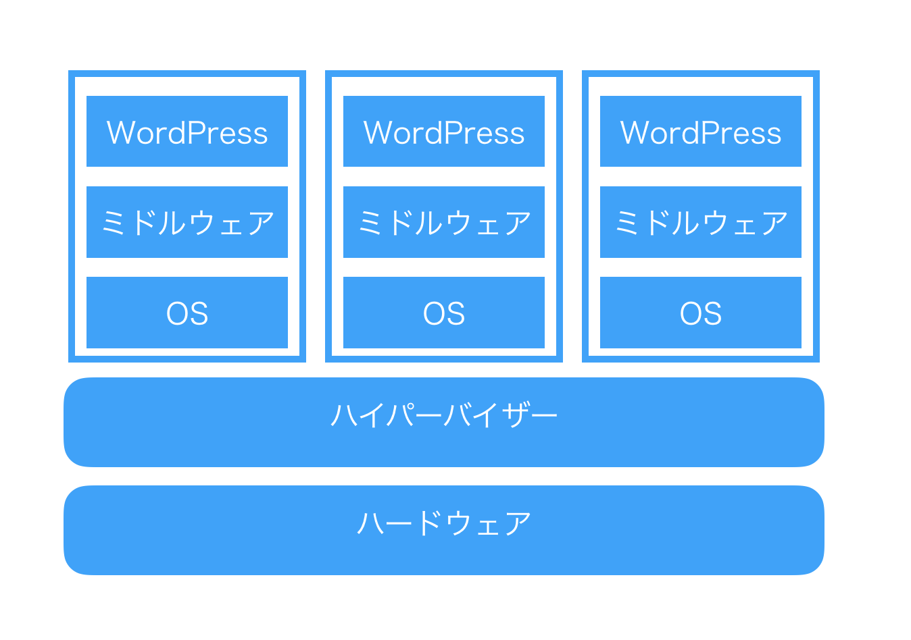

もちろん、「1台のハードで複数のOSを使いたい」といった類の要望に対してはいまでもこれがベストソリューションであるが、Webサイト運用の現場ではサイトの複製や冗長化などの要望が強く、AWS EC2やGCPのCompute Engineにおいても繰り返しOSのインストールをする煩わしさがある。マシンイメージを残すことである程度の簡便さはもたらされるが、まったく同じ数GBのOSが何度もインストールされるのは巨視的な視点で見ると完全な無駄である。

そうした状況に颯爽と現れたDockerは、よりシンプルな「コンテナ」という概念をもたらした。コンテナとハイパーバイザ・ホスト型との違いを図示すると、次の図になる。

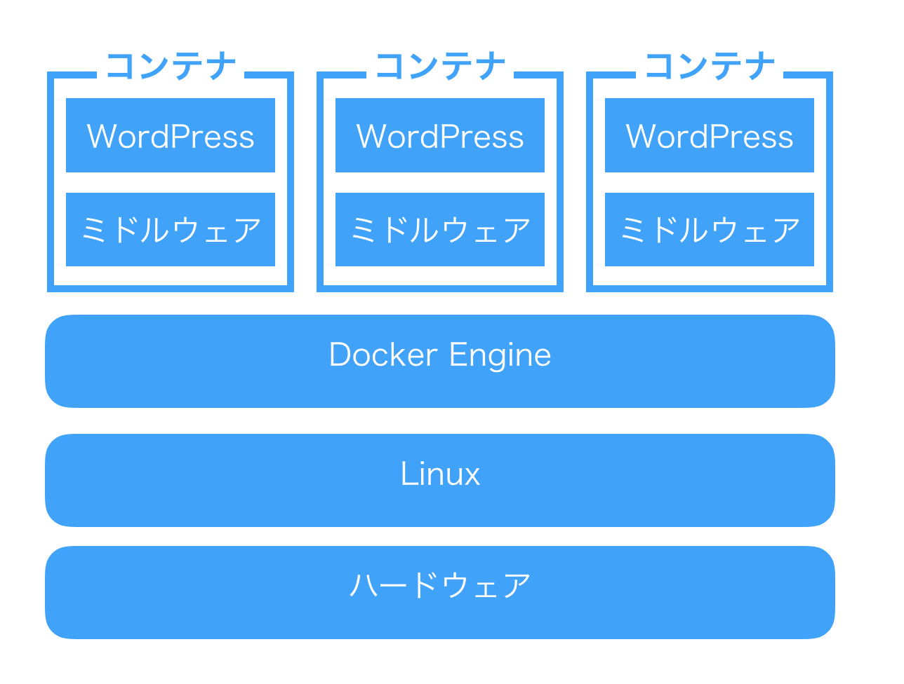

コンテナにおいては、OS（Linuxカーネルといってしまっていいだろう）は共有される。コンテナの作成もDockerではDockerfileと呼ばれるレシピファイルを元に作成することができ、自動かもたやすい。こうしてDockerは仮想化技術の新しいスタンダードとして名乗りを挙げたのである。

そんなDockerが普及するにつれ、当然ながらWebサイトを運営する人々はこのDockerを管理するツールの必要性を感じるようになった。具体的にはこんな要望である。

- サイトのトラフィックに応じてコンテナの数を自動的に増減させたい。
- 障害があったら自動的に復旧してほしい。
- デプロイを自動化し、新機能の部分的な適用やフォールバックなどを行いたい。

そこで登場したのがKubernetesである。Kubernetesは「オーケストレーション・ツール」と呼ばれることがあるように、様々な楽器を取り揃えたオーケストラを率いる指揮者さながら、各コンテナを管理するツールである。とりわけ、コンテナ間の通信などのDockerで面倒だと思われていたケースにおいて力を発揮するようだ。要するに、大規模な構成においてDockerで面倒だと思われていた部分をいい感じになんとかしてくれる、それがKubernetesであるらしい。

そんなことを言われても……と読者であるあなたが訝るのも無理はない。というのも、筆者もまた、現時点でKubernetesを一度も触ったことがないからだ。それでは前段はこれぐらいにして、実際にCapital Pをスケールアウト可能な分散型環境に展開してみよう。

## 構成およびツールの確認

さて、それではKubernetes（以下、k8s）でなにをすればいいのかを確認しよう。

まずは用語の確認から。

|用語|説明|
|----|----|
|マスター|ノードを制御するマシン。すべての親だと思えば良さそう。|
|ノード|タスクを実行するマシン。|
|Pod|いくつかのコンテナをまとめたグループのこと。ノードにデプロイされる。|
|サービス|Podに対する作業の指示|

### 設定ファイル

さて、これからなにをしなければいけないかというと、設定ファイルの作成である。k8sでは、すべてのPodが使い捨てであり、それらはYAMLファイルを元に構築される。どのPodが死んで、どのように再作成されるのかはあまり意識する必要がない。設定ファイルの例は以下。

```
apiVersion: v1
kind: Service
metadata:
  labels:
    app: wordpress
  name: wordpress
spec:
  type: LoadBalancer
  ports:
    - port: 80
      targetPort: 80
      protocol: TCP
  selector:
    app: wordpress
```

この設定ファイルの`kind`という部分で、この設定ファイルがなにをするものなのかを定義しているようだ。今回の場合、MySQLと永続ディスクは第3章ですでに作成済みなので、WordPressが動作するPodと、それらのPodにアクセスを分散するサービスを作成する必要がある。

### ツール

ツールには主に2種類ある。1つ目は`gcloud`コマンドで実行されるGoogle Cloud SDKだ。こちらは前章で説明済みである。もう1つ、k8sをコントロールするための`kubectl`が必要だ。これは`gcloud`コマンドを利用してインストールすることができる。

```
gcloud components install kubectl
```

また、Google Kubernetes Engineを利用するためには課金を有効にする必要があるので、まだの人は第3章を参考にしていただきたい。

それでは準備完了だ。いよいよ実践編に入ろう。

### スナップショットの作成

さて、GCEですでに利用されている永続ディスクをk8sのクラスタにアタッチすることはできないようなので、第3章で作成したディスクをコピーしよう。まずはスナップショットを作成する。


続いて、そのスナップショットを元に新たな永続ディスクを作成する。新しい名前は`capitalp-nfs-k8s`としておこう。


これで準備完了だ。

## Kubernetesクラスタの作成

まずはクラスタを作成する必要がある。[Kubernetes Engineのページ](https://console.cloud.google.com/projectselector/kubernetes?hl=ja)へ移動し、プロジェクトを選択しよう。今回は第3章で作成した`CapitalP`プロジェクトを利用する。


さて、プロジェクトを紐づけたら、早速基本設定を行う。設定項目は次の通り。


変更したのは次の点である。

- ロケーションは第3章での設定にあわせ、`asia-northeast1-b`とする。
- マシンタイプは一番安い`micro`。ノード数は3以下にできないようなので、最小の3とする。
- 自動ノード修復をオンにする。おそらくだが、ノードが壊れた時に勝手に治るのだろう。なにをもって「壊れた」と定義するのかは謎だが、便利そうな機能ではある。
- 自動スケーリングをオンにする。最小と最大を選ぶことができるので、たぶんアクセス数が増大すると、勝手にノードを増やしてくれるのではないだろうか。今回は最小3で最大を10とした。
- ノードあたりのブートディスクサイズは10GBもあれば十分だろう。


それではいよいよクラスタの設定を開始しよう。以降はコマンドラインツールでの処理が必須となる。まずは作業ディレクトリとして、ローカル・マシーン（筆者の場合はMacbook）に作業用ディレクトリを設定しよう。ローカルでの作業は基本的に`~/Documents/GCP/capitalp`で行うこととする。

```
mkdir -p ~/Documents/GCP/capitalp
cd ~/Documents/GCP/capitalp
# これ以降はこのディレクトリでの作業。
```

## クラスタの設定

まずはプロジェクトを操作するために、`gcloud`コマンドの設定をしよう。基本的にはクラスタを操作するので、簡略化のために`gcloud`コマンドのデフォルト値を設定する。対象はプロジェクトID（プロジェクト一覧に表示されている）とゾーン。本来は`--project=capitalp-182517`といった具合に入力しなければならないが、簡略化のために設定しておく。もちろん、複数プロジェクトを管理する場合はこの限りではない。これらの情報のいくつかは公式チュートリアルに記載されていなかったが、`kubectl`を利用する時にエラーが発生するので、ブログ[DRYな備忘録](http://otiai10.hatenablog.com/entry/2016/04/07/061601)などを参考にしてほしい。

```
# プロジェクトCapital Pをデフォルトに
gcloud config set project capitalp-182517
# おなじく、ゾーンも
gcloud config set compute/zone asia-northeast1-b
# クラスタのデフォルトを設定
gcloud config set container/cluster capitalp-k8s
# 鍵情報を取得（よくわからない）
gcloud container clusters get-credentials capitalp-k8s
```

それでは、早速マニフェストファイルの作成をしよう。k8sの運用においては、レシピファイルをローカルで作成し、それをコマンドラインツールを通じてGCPに送りつける形をとる。まずはWordPressを動かすPHPサーバーのレシピ`wordpress.yaml`から作成しよう。

```
apiVersion: extensions/v1beta1
kind: Deployment
metadata:
  name: wordpress
  labels:
    app: wordpress
spec:
  replicas: 1
  selector:
    matchLabels:
      app: wordpress
  template:
    metadata:
      labels:
        app: wordpress
    spec:
      containers:
        - image: wordpress
          name: wordpress
          env:
          - name: WORDPRESS_DB_HOST
            value: 127.0.0.1:3306
          - name: WORDPRESS_DB_PASSWORD
            value: **************
          ports:
            - containerPort: 80
              name: wordpress
          volumeMounts:
            - name: wordpress-persistent-storage
              mountPath: /var/www/html
      volumes:
        - name: wordpress-persistent-storage
          gcePersistentDisk:
            pdName: capitalp-nfs-k8s
            fsType: ext4
```

これらのファイルは基本的に[公式チュートリアル](https://cloud.google.com/kubernetes-engine/docs/tutorials/persistent-disk?hl=ja)を参考にしたものだが、以下の点で異なっている。

- 永続ディスク`spec > template > spec > volumes > gcePersistentDisk > pdName`は先ほど作成した`capitalp-nfs-k8s`を指定。
- `spec > template > spec > containers > volumeMounts > mountPaht`は同じく第3章で作成した`/var/www/wordpress`と異なるが、これは決め打ちらしい。

さて、これで基本的には問題ないはずなのだが、まだMySQLの接続情報を指定する必要がある。公式チュートリアルではWordPress（PHPサーバー）とMySQLの2種類のPodを作成していたが、今回はCloud SQLを利用するのでMySQLのPodは必要ない。しかし、Cloud SQLに繋げるには第3章で紹介した通り、[cloud_sql_proxyを利用](https://cloud.google.com/sql/docs/mysql/connect-container-engine?hl=ja)しなければならない。Google Compute Engineで接続するときとは少し勝手が違うようだ。

まずは、cloud_sql_proxy経由で接続する専用のMySQLユーザーを作る必要があるらしい。そのためのコマンドは次の通り。`gcloud`コマンドから作成する。

```
gcloud sql users create proxyuser cloudsqlproxy~% --instance=capitalp-db-master
```

本当にユーザーが作成されたのかどうか、Sequel Proで表示してみよう。以前やったとおり、ローカル・マシーンからCloud SQLに接続する方法は次の通り。

```
# 第3章で作成した、cloud_sql_proxyのディレクトリがあるホームディレクトリへ移動。
cd ~
# 接続開始。
cloud_sql_proxy -dir=.cloud_sql_proxy -instances=capitalp-182517:asia-northeast1:capitalp-db-master -credential_file=.ssh/google/capitalp-ce01.json
```


今回の場合、インスタンス接続名は`capitalp-182517:asia-northeast1:capitalp-db-master`である。もしわからない場合は次のコマンドで取得すること。

```
gcloud sql instances describe capitalp-db-master
```

基本的には`プロジェクトID:ゾーン名:インスタンスID`となっているらしい。続いて、第3章で作成したサービスアカウントの鍵情報を用いて、PodからCloud SQLに接続できるようなシークレット`cloudsql-db-credentials`を作成する必要がある。

```
# ホームディレクトリに移動
cd ~
kubectl create secret generic cloudsql-instance-credentials --from-file=credentials.json=.ssh/google/capitalp-ce01.json
# -> secret "cloudsql-instance-credentials" created
# proxyuserをのためのシークレットを作成する
kubectl create secret generic cloudsql-db-credentials --from-literal=username=proxyuser
# -> secret "cloudsql-db-credentials" created
```

これでシークレット（たぶんJSONみたいなもの）が作成されたので、先ほどの`wordpress.yaml`の接続情報を次のように変更する。ポイントとしては、データベース接続情報のパスワード`WORDPRESS_DB_PASSWORD`が空になっていることだ。本当かどうかはわからないが、そもそもProxyを経由しないとCloud SQLに接続できないので、パスワードを設定しなくてもいいとのこと。

それでは、`wordpress.yaml`を次のように編集しよう。実際に再びホームディレクトリから作業ディレクトリ`~/Documents/GCP/capitalp`まで移動することを忘れないように。

```
apiVersion: extensions/v1beta1
kind: Deployment
metadata:
  name: wordpress
  labels:
    app: wordpress
spec:
  replicas: 1
  selector:
    matchLabels:
      app: wordpress
  template:
    metadata:
      labels:
        app: wordpress
    spec:
      containers:
        - image: wordpress
          name: wordpress
          env:
            - name: WORDPRESS_DB_HOST
              value: 127.0.0.1:3306
            - name: WORDPRESS_DB_USER
              valueFrom:
                secretKeyRef:
                  name: cloudsql-db-credentials
                  key: username
            - name: WORDPRESS_DB_PASSWORD
              value: ''
          ports:
            - containerPort: 80
              name: wordpress
          volumeMounts:
            - name: wordpress-persistent-storage
              mountPath: /var/www/html
        - name: cloudsql-proxy
          image: gcr.io/cloudsql-docker/gce-proxy:1.11
          command: ["/cloud_sql_proxy",
                    "-instances=capitalp-182517:asia-northeast1:capitalp-db-master=tcp:3306",
                    "-credential_file=/secrets/cloudsql/credentials.json"]
          volumeMounts:
            - name: cloudsql-instance-credentials
              mountPath: /secrets/cloudsql
              readOnly: true
      volumes:
        - name: wordpress-persistent-storage
          gcePersistentDisk:
            pdName: capitalp-nfs-k8s
            fsType: ext4
        - name: cloudsql-instance-credentials
          secret:
            secretName: cloudsql-instance-credentials
```

それでは、上記ファイルをデプロイしよう。デプロイメントは非常に簡単で、コマンド一発のようだ。

```
kubectl create -f wordpress.yaml
# -> deployment "wordpress" created
```

続いて、Podが動作しているのかを確認する。準備ができるまで数分かかるらしいので、気長に待とう。

```
kubectl get pod -l app=wordpress
```

間違いがあった場合は、コンソールの`Kubernets Engine > ワークロード > wordpress > YAML`と移動すると、YAMLを直接編集することができる。

## プロジェクトの公開

さて、これで3台のノードがWordPressを密かに動かしている状態なわけだが、これをどのようにして公開したらよいのか？

そのためにはロードバランサ（有料）をサービスとして登録し、それぞれのPodに紐づける必要がある。ローカルの`~/Documents/GCP/capitalp`まで移動し、新たな設定ファイル`wordpress-service.yaml`を作成しよう。

```
apiVersion: v1
kind: Service
metadata:
  labels:
    app: wordpress
  name: wordpress
spec:
  type: LoadBalancer
  ports:
    - port: 80
      targetPort: 80
      protocol: TCP
  selector:
    app: wordpress
```

それでは、この設定をデプロイする。コマンドは次の通り。

```
kubectl create -f wordpress-service.yaml
# -> service "wordpress" created
```


IPアドレスが表示されているので、実際にアクセスしてみよう。トップページにアクセスすると、WordPressの機能によってカノニカルURLにリダイレクトされてしまうので、Capital Pに固有のテーマcapitalpのスタイルシートにアクセスする。


実際に公開するとなると、第3章で行ったように、DNSを振り向ける必要がある。GCPのロードバランサーが優れている点として、[エニーキャストIP](https://cloud.google.com/load-balancing/?hl=ja)という仕組みにより、単一のIPアドレスで終端できる点をあげられる。これはAWSのロードバランシングにはなかった利点で、ルートドメイン（`www.capitalp.jp`ではなく、`capitalp.jp`）のようにCNAMEを利用することができないドメインでも、特に意識することなくDNS設定を行うことができる。今回は`k8s.capitalp.jp`にアクセスしたときだけk8s環境に接続するようにしてみよう。

### ディスクへのアクセス

現在のところ、第3章で構築したGCE環境（商用環境）と本章で構築したGKE環境（テスト環境）が同じDBに接続しているという致命的な自体にある。したがって、今回は永続ディスク`capitalp-nfs-k8s`の`wp-config.php`を次のように編集し、`k8s.capitalp.jp`にアクセスできるようにしたい。

```
define( 'WP_SITEURL', 'https://k8s.capitalp.jp' );
define( 'WP_HOME', 'https://k8s.capitalp.jp' );
```

GKEでk8sプロジェクトを作成し、無事ノードが立ち上がると、その数だけインスタンスが作成される。このリストはCompute Engineのダッシュボードから「インスタンスグループ」をクリックすることで確認できる。

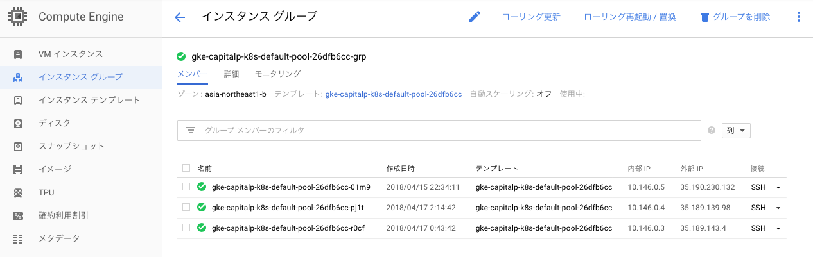

この中の任意の1つに対してSSHでの接続してみよう。あとはここからファイルを編集すればよいのだが、ここでWordPressディレクトリが保存されている`/var/www/html`を表示しようとしても見つからない。なぜかというと、このインスタンスはあくまでDockerを動かしている仮想マシンであって、WordPressのPod本体ではないからだ。試しに動作しているDockerを`docker ps`コマンドでリストしてみよう。

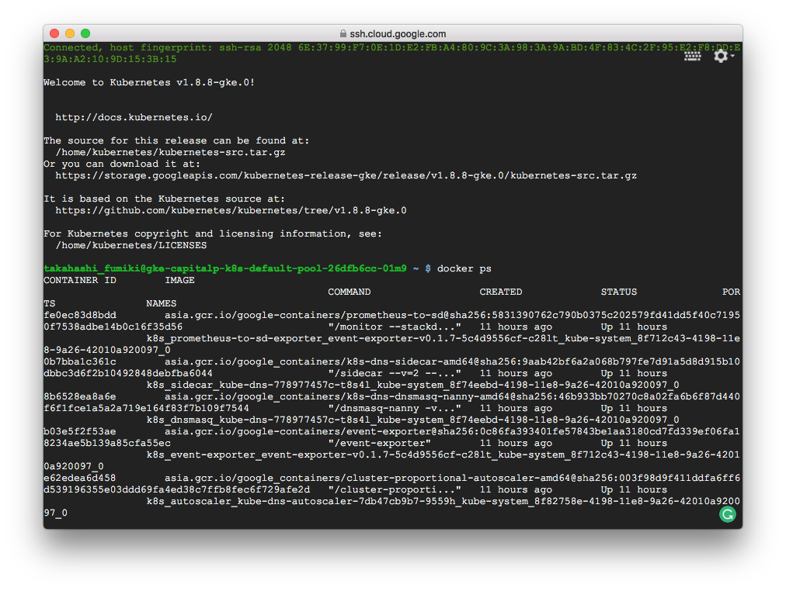

さて……どのコンテナにアクセスすればよいのだろうか？　たくさんありすぎて、そもそもどれが何をしているのかがさっぱりわからない。どうも、k8sにおいては`kubectl`を利用するのが正解なようだ。それでは、GCPのシェル画面からログアウトして、ローカルのMacで作業を続けよう。

```
# 稼働しているPodを調べる
kubectl get pods

NAME                         READY     STATUS    RESTARTS   AGE
wordpress-654fbf865c-x6pv6   2/2       Running   0          7h

# Podにbashでログインする
kubectl exec -it wordpress-654fbf865c-x6pv6 bash

# root@wordpress-654fbf865c-x6pv6:/var/www/html
# ログインに成功したらしい。
# ドキュメントルートのファイルを表示する。
ls -alG /var/www/html/
total 232
drwxrwxrwx   6   48  4096 Apr 16 21:57 .
drwxr-xr-x   3 root  4096 Apr 16 21:57 ..
-rw-rw-r--   1   48   418 Apr  4 10:18 index.php
-rw-rw-r--   1   48 19935 Apr  5 13:12 license.txt
drwx------   2   48 16384 Apr  1 16:16 lost+found
-rw-r--r--   1   48  1419 Apr  4 10:18 php_errors.log
-rw-rw-r--   1   48 10303 Apr  5 13:12 readme.html
-rw-rw-r--.  1   48    17 Apr  1 16:26 test.php
-rw-rw-r--   1   48  5438 Apr  4 10:18 wp-activate.php
drwxrwxr-x  10   48  4096 Apr  1 16:50 wp-admin
-rw-rw-r--   1   48   364 Apr  4 10:18 wp-blog-header.php
-rw-rw-r--   1   48  1627 Apr  4 10:18 wp-comments-post.php
-rw-rw-r--   1   48  3793 Apr 16 21:57 wp-config-sample.php
-rw-rw-r--   1   48  4723 Apr 16 21:57 wp-config.php
drwxrwxr-x   9   48  4096 Apr 15 13:29 wp-content
-rw-rw-r--   1   48  3669 Apr  4 10:19 wp-cron.php
drwxrwxr-x  18   48 12288 Apr  1 16:51 wp-includes
-rw-rw-r--   1   48  2422 Apr  4 10:19 wp-links-opml.php
-rw-rw-r--   1   48  3306 Apr  4 10:19 wp-load.php
-rw-rw-r--   1   48 36593 Apr  4 10:19 wp-login.php
-rw-rw-r--   1   48  8048 Apr  4 10:19 wp-mail.php
-rw-rw-r--   1   48 16246 Apr  4 10:19 wp-settings.php
-rw-rw-r--   1   48 30071 Apr  4 10:19 wp-signup.php
-rw-rw-r--   1   48  4620 Apr  4 10:19 wp-trackback.php
-rw-rw-r--   1   48  3065 Apr  4 10:19 xmlrpc.php

# wp-config.phpを編集する。
vim wp-config.php
bash: vim: command not found
# vimが入っていない……インストールしてみよう。
apt-get update
apt-get install vim
# 成功した。ファイルを編集し、WP_HOMEとWP_SITEURLを設定する。
vim wp-config.php

define( 'WP_SITEURL', 'https://k8s.capitalp.jp' );
define( 'WP_HOME', 'https://k8s.capitalp.jp' );
```

さて、あとはDNSでドメイン`k8s.capitalp.jp`をクラスタのIPアドレス`35.190.238.251`に振り向ければ、`k8s.capitalp.jp`でアクセスできるはずだ。

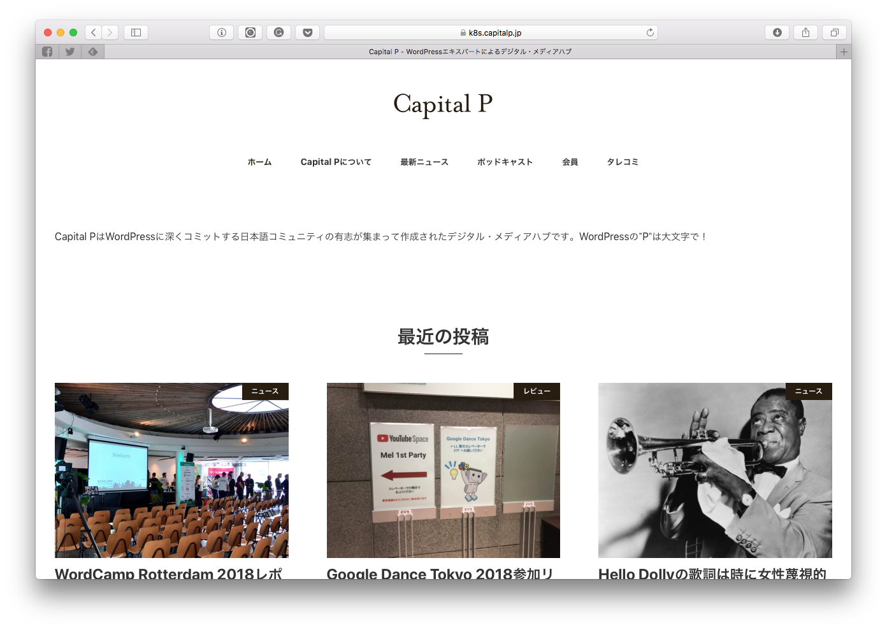

表示成功！　あとは筆者の心配事として、「メディアのアップロードは可能なのか？」という点がある。第3章で「永続ディスクは読み取り専用」という情報を得ていたので、もしかしたらファイルの書き込みができないのではないだろうか。第4章でもメディアのアップロードで苦労していた。実際にやってみよう……と思ってメディアライブラリにアクセスしてみたところ、サイトが落ちてしまった。もしかしたら、VMをもっと大きなサイズにしなければならないのだろうか？

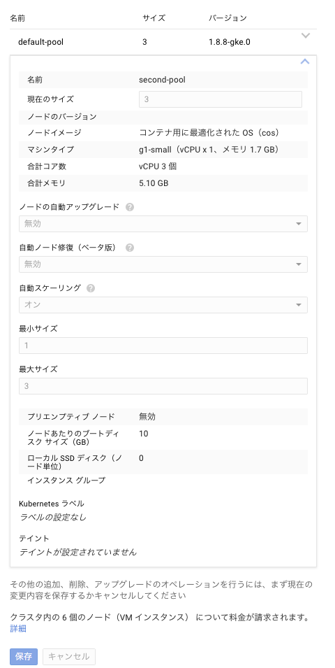

既存のノードのマシンタイプは変更できないようなので、1.7GBのメモリを持つノードを最大で3台まで追加し、デフォルトのプールを削除してみた。ノードの構成を変更すると、適用まで結構な時間がかかるようなので、我慢強く待機する。その後、アップロードしてみると……。

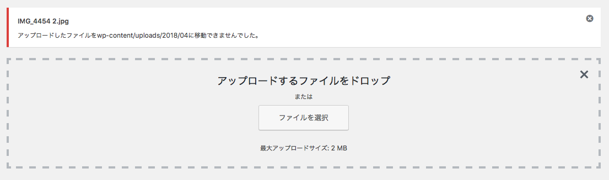

予想通りエラーとなった。また、現在は1台のみとなっているWordPressデプロイメントの設定で`replica`を3にして、ノードに展開する数を増やすと、エラーが表示された。

つまり、先ほど`kubelctl`でログインしてファイルを編集できたのは、Podの数が1つしかなかったからであり、複数のレプリカが増減する状況になると、そうはいかないようだ。やはり、単体の永続ディスク`capitalp-nfs-k8s`を複数のPodから利用することは不可能で、NFSを作成する必要がある。

## NFSサーバーの作成

[公式マニュアル](https://cloud.google.com/kubernetes-engine/docs/how-to/stateful-apps)とWordPress向けのNFSを作成するチュートリアル[Running Highly Available WordPress With MySQL On Kubernetes](https://rancher.com/running-highly-available-wordpress-mysql-kubernetes/)があったので、それを参考にする。以下の作業は設定ファイルを利用するので、ローカルPCの`~/Documents/GCP/capitalp/`フォルダを前提とする。

まずは、永続ディスクをデタッチする。`wordpress.yaml`の`VolumeMounts`と`volumes > wordpress-persistent-storage`を削除する。

```
apiVersion: extensions/v1beta1
kind: Deployment
metadata:
  name: wordpress
  labels:
    app: wordpress
spec:
  replicas: 3
  selector:
    matchLabels:
      app: wordpress
  template:
    metadata:
      labels:
        app: wordpress
    spec:
      containers:
        - image: wordpress
          name: wordpress
          env:
            - name: WORDPRESS_DB_HOST
              value: 127.0.0.1:3306
            - name: WORDPRESS_DB_USER
              valueFrom:
                secretKeyRef:
                  name: cloudsql-db-credentials
                  key: username
            - name: WORDPRESS_DB_PASSWORD
          ports:
            - containerPort: 80
              name: wordpress
        - name: cloudsql-proxy
          image: gcr.io/cloudsql-docker/gce-proxy:1.11
          command: ["/cloud_sql_proxy",
                    "-instances=capitalp-182517:asia-northeast1:capitalp-db-master=tcp:3306",
                    "-credential_file=/secrets/cloudsql/credentials.json"]
          volumeMounts:
            - name: cloudsql-instance-credentials
              mountPath: /secrets/cloudsql
              readOnly: true
      volumes:
        - name: cloudsql-instance-credentials
          secret:
            secretName: cloudsql-instance-credentials
```

保存したら、`kubectl replace --force -f wordpress.yaml`で設定を置換する。うまくいけば、永続ディスクは使用リソースがなくなるはずだ。

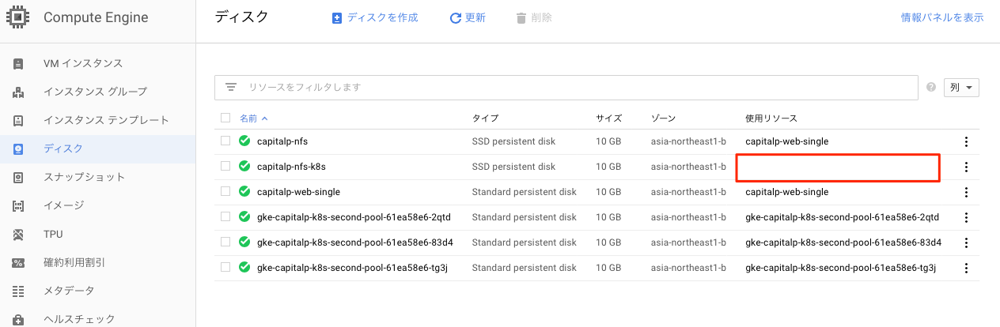

続いて、NFSを作成していく。永続ディスク`capitalp-nfs-k8s`をアタッチしたNFSサーバーのPodを作成しよう。

```
apiVersion: extensions/v1beta1
kind: Deployment
metadata:
  name: nfs-server
spec:
  replicas: 1
  selector:
    matchLabels:
      role: nfs-server
  template:
    metadata:
      labels:
        role: nfs-server
    spec:
      containers:
      - name: nfs-server
        image: gcr.io/google_containers/volume-nfs:0.8
        ports:
          - name: nfs
            containerPort: 2049
          - name: mountd
            containerPort: 20048
          - name: rpcbind
            containerPort: 111
        securityContext:
          privileged: true
        volumeMounts:
          - mountPath: /exports
            name: nfs-pvc
      volumes:
        - name: nfs-pvc
          gcePersistentDisk:
            pdName: capitalp-nfs-k8s
            fsType: ext4
```

このファイルを`nfs-server.yaml`として保存したら、`kubectl create -f nfs-server.yaml`でデプロイする。登録されたら、`kubectl get pods`でNFS用のPodが登録されているかを確認しよう。コントロールパネルの「Compute Engine > ディスク」でも該当するディスクの使用リソースが割り当てられているはずだ。

続いて、このPodを内部ネットワークに公開するためのサービスを作成する。

```
kind: Service
apiVersion: v1
metadata:
  name: nfs-server
spec:
  ports:
    - name: nfs
      port: 2049
    - name: mountd
      port: 20048
    - name: rpcbind
      port: 111
  selector:
    role: nfs-server
```

`nfs-service.yaml`として保存したら、`kubectl create -f nfs-service.yaml`を実行。コントロールパネルの「Kubernets Engine > 検出と負荷分散」を見ると、クラスタ内部からアクセスできるIP`10.51.245.11`が提供されているのがわかる。

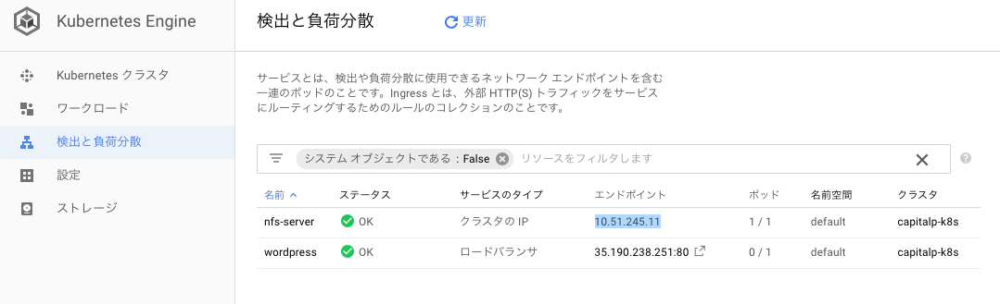

なお、k8sでは、クラスタ内DNSで自動的に`サービス名.名前空間.svc.cluster.local`が割り当てられるようだ。したがって、このNFSのアドレスは`nfs-server.default.svc.cluster.local`となる。

続いて、このNFSサーバーを永続ボリュームとして登録する。Kubernetesには[永続ボリューム](https://access.redhat.com/obsolete-documentation/ja/red-hat-enterprise-linux-atomic-host/7/paged/getting-started-with-containers/chapter-6-get-started-provisioning-storage-in-kubernetes)という概念があり、Podから利用するためのディスクを永続ボリュームとして登録し、さらに「永続ボリューム要求」を出す必要がある。「永続ディスクをNFSにして永続ボリュームとして登録のうえ永続ボリューム要求を出す」と書くと、何が何だかわからないのだが、k8sのお作法のようなものだと思っておくといいだろう。

```
apiVersion: v1
kind: PersistentVolume
metadata:
  name: nfs
spec:
  capacity:
    storage: 10Gi
  accessModes:
    - ReadWriteMany
  nfs:
    server: nfs-server.default.svc.cluster.local
    path: /

---
kind: PersistentVolumeClaim
apiVersion: v1
metadata:
  name: nfs
spec:
  accessModes:
    - ReadWriteMany
  storageClassName: ""
  resources:
    requests:
      storage: 10Gi
```

上記を`nfs-pv.yaml`として保存したら、`kubectl create -f nfs-pv.yaml`としてデプロイ。コントロールパネルの「ストレージ」に「永続ボリュームの要求」として登録されているのが確認できる。

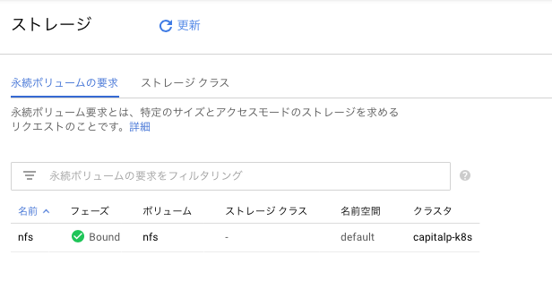

それでは、WordPressの設定ファイル`wordpress.yaml`で、マウントするディスクの指定を書き換えよう。ついでに、Podの数も3に指定し、同時にいくつかのサーバーを立ち上げてしまおう。

```
apiVersion: extensions/v1beta1
kind: Deployment
metadata:
  name: wordpress
  labels:
    app: wordpress
spec:
  replicas: 1
  selector:
    matchLabels:
      app: wordpress
  template:
    metadata:
      labels:
        app: wordpress
    spec:
      containers:
        - image: wordpress
          name: wordpress
          env:
            - name: WORDPRESS_DB_HOST
              value: 127.0.0.1:3306
            - name: WORDPRESS_DB_USER
              valueFrom:
                secretKeyRef:
                  name: cloudsql-db-credentials
                  key: username
            - name: WORDPRESS_DB_PASSWORD
          ports:
            - containerPort: 80
              name: wordpress
          volumeMounts:
            - name: nfs-server
              mountPath: /var/www/html
        - name: cloudsql-proxy
          image: gcr.io/cloudsql-docker/gce-proxy:1.11
          command: ["/cloud_sql_proxy",
                    "-instances=capitalp-182517:asia-northeast1:capitalp-db-master=tcp:3306",
                    "-credential_file=/secrets/cloudsql/credentials.json"]
          volumeMounts:
            - name: cloudsql-instance-credentials
              mountPath: /secrets/cloudsql
              readOnly: true
      volumes:
        - name: nfs-server
          persistentVolumeClaim:
              claimName: nfs
        - name: cloudsql-instance-credentials
          secret:
            secretName: cloudsql-instance-credentials
```

保存したら、`kubectl replace --force -f wordpress.yaml`で置換を行う。さて、これでPodが再起動したら、無事ファイルが読み込まれるはずだ。なお、先ほど画像をアップロードできなかったのは、NFSのパーミッションのせいであった。NFS内の所有権をWordPressコンテナのApacheユーザー(www-data) に合わせておくと問題なく画像をアップロードできる。

```
# ローカルでの作業。Podのリストを表示
kubectl get pods
NAME                         READY     STATUS    RESTARTS   AGE
nfs-server-767c7b9-5th4f     1/1       Running   0          1h
wordpress-567647cdf6-cmlks   2/2       Running   0          54m

# WordPressコンテナにログイン。
kubectl exec -it wordpress-567647cdf6-cmlks bash
# www-dataのユーザーIDを調べる
cat /etc/passwd
# -> www-data:x:33:33:www-data:/var/www:/usr/sbin/nologin
# ログアウト

# NFSにログイン。
kubectl exec -it nfs-server-767c7b9-5th4f bash
# マウントしているディスクの所有権をID33(www-data)に。
chown -R 33:33 /exports
```

さて、それではWordPressコンテナの数を複数にしてみよう。`wordpress.yaml`の`spec > replicas`を3にする。

```
apiVersion: extensions/v1beta1
kind: Deployment
metadata:
  name: wordpress
  labels:
    app: wordpress
spec:
  replicas: 3
```

それではこれを`kubectl replace -f wordpress.yaml --force`でデプロイしよう。

```
kubectl get pods

NAME                         READY     STATUS    RESTARTS   AGE
nfs-server-767c7b9-5th4f     1/1       Running   0          1h
wordpress-567647cdf6-57sgd   2/2       Running   0          7s
wordpress-567647cdf6-cmlks   2/2       Running   0          1h
wordpress-567647cdf6-zfs6n   2/2       Running   0          7s
```

コンテナの数が自動で増えたようだ。では、複数台構成で無事画像をアップロードできるのだろうか？

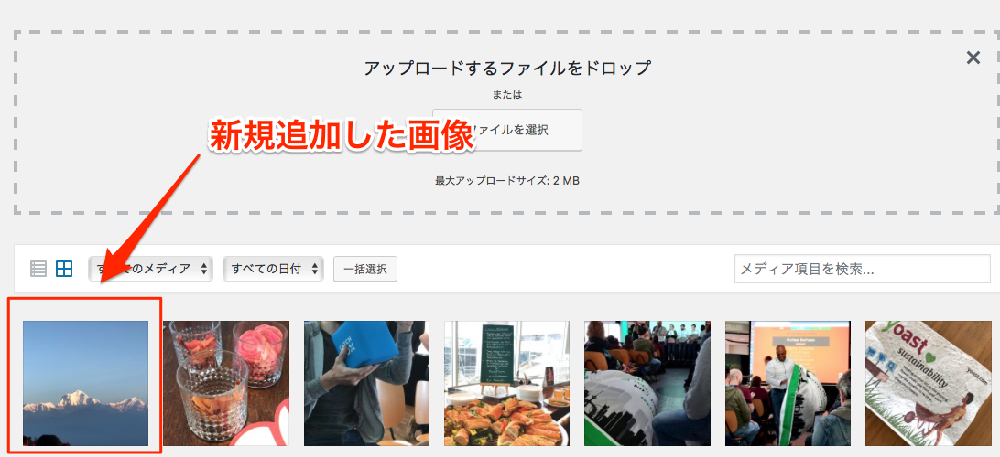

ついにファイルのアップロードを確認した。プラグインのインストールも問題なくできているようである。これでようやくまともに動くWordPress環境が完成した。

## その他のタスク

さて、実際にk8s環境で運用するとなると、他にやるべきこといくつかある。ざっと挙げてみよう。

### オートスケール

Podの数が自動で増減するような仕組みは是非ともほしいところだ。スケールの設定はコマンドで確認することができる。

```
# 現在の状態を確認
kubectl get deploy wordpress
NAME        DESIRED   CURRENT   UP-TO-DATE   AVAILABLE   AGE
wordpress   3         3         3            3           7m

# CPU使用率50%で最大6 Podまで増やす。
kubectl autoscale deployment wordpress --cpu-percent=50 --min=1 --max=6

# さっきまで3台だったのが1台になった。
kubectl get pods
NAME                         READY     STATUS    RESTARTS   AGE
nfs-server-767c7b9-5th4f     1/1       Running   0          1h
wordpress-567647cdf6-cmlks   2/2       Running   0          1h
```

ノードのスケールアウト（台数を増やす）、ノードのスケールアップ（VMの性能を上げる）、Podのスケールアウト（Podの数を増やす）を組み合わせることがコンテナ技術のキモなので、ここら辺は色々とチューニングのやりようがありそうだ。ブログ記事[GKEでPodとNodeをAutoscalingする](https://qiita.com/k-hal/items/5f060fdbafa3d29b3499)が詳しかったので参考にしてほしい。

### デプロイメント

Webサイトを運営する以上、当然ながらファイルはデプロイすることができなくてはならない。Gitなどで自動デプロイ専用のノードを用意するなど、すればかなりモダンな開発環境になるだろうが、毎回そこまでできるかというと、現実的ではない。SFTPによるアップロードしかできない人材がアサインされることもままあるだろうし、その場合の選択肢も用意しておくべきだろう。

### MySQLの冗長化

Cloud SQLはリードレプリカ（読み取り専用のコピー）とフェイルオーバーレプリケーション（バックアップを取っておいて、問題があったら入れ替える）があるようだ。ただし、最近のWordPress業界で流行っているのは、MySQLの冗長化を頑張るよりも、キャッシュなどを使ってそもそもDBにアクセスする回数を減らすことである。HyperDBなどのMySQL冗長化の試みもいくつかあったが、最近はあまり熱心にメンテナンスされていない印象だ。

クラウドサービスの手軽さを享受しつつ、なるべくDBに負荷をかけない運用を心がけるべきだろう。

### CRON、コマンドラインでの処理

Caiptal PではWordPressに必須の処理`WP_CRON`を[外部コマンドで行っている](https://capitalp.jp/2018/02/10/best-practice-of-batch-processing-in-wp/)のだが、クラスタ内の特定のPodにだけCron処理を行わせるためにどうしたらよいのかについても検討する必要があるだろう。

### 固定IP

それぞれのノードがどのような固定IPを持つのかについても検討が必要だ。日本のレガシーなサービスでは、特定のIPからのアクセスに対してしかサービスを提供しないことがあるので、そうしたサービスがクリティカルな場合、調査すべきことはいくつかありそうだ。

## まとめ

k8sを利用する最大のメリットは、コンテナ技術による水平展開だろう。負荷分散に関しては、正直なところGCEでも似たようなことはできるし、そもそもAWSにも同等の機能は存在する。Amimotoに代表されるAMI(Amazon Machine Image)のような知見が豊富にあることを考えると、もしかしたらAWSの方が簡単かもしれない。

しかし、`gcloud`に代表されるSDKとREST可能な管理画面操作は、ホスティングなどの「大量の人にWordPress環境を提供するビジネス」を考えている人には大いなるメリットをもたらすだろう。AWSよりもシンプルな構成もビジネスの発展を加速してくれる一因となるはずだ。料金に関してはAWSと比較すると確かに安い印象だ。

いずれにせよ、コンテナ技術がいまクラウド業界でもっとも注目されている技術なのは間違いない。WordPressでコンテナ入門するのも決して悪くない投資だと筆者は断言したい。