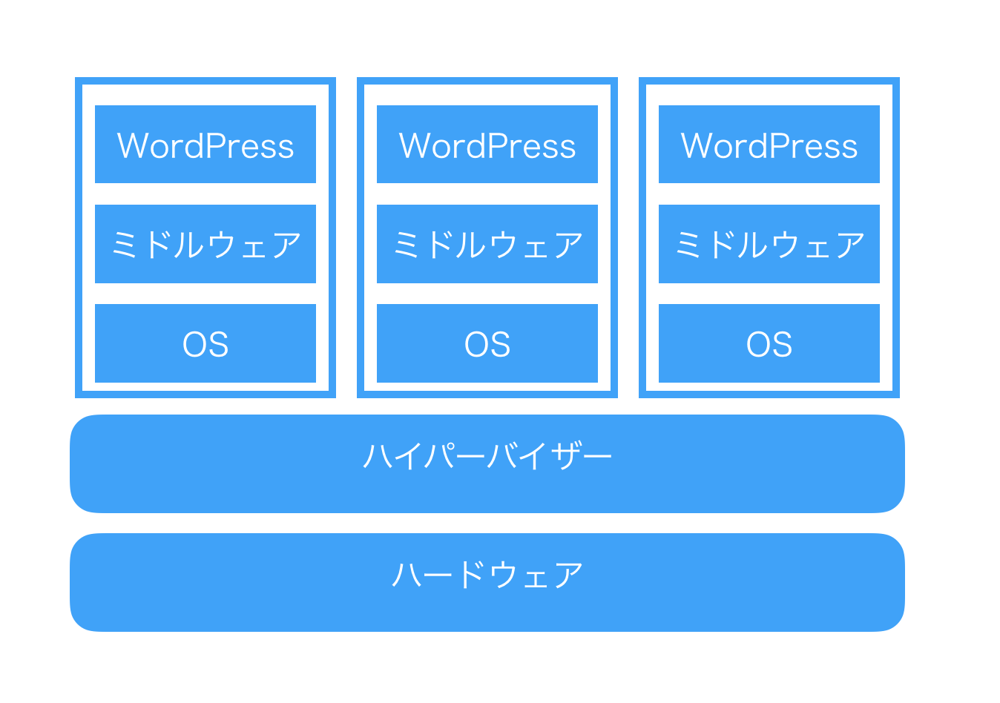
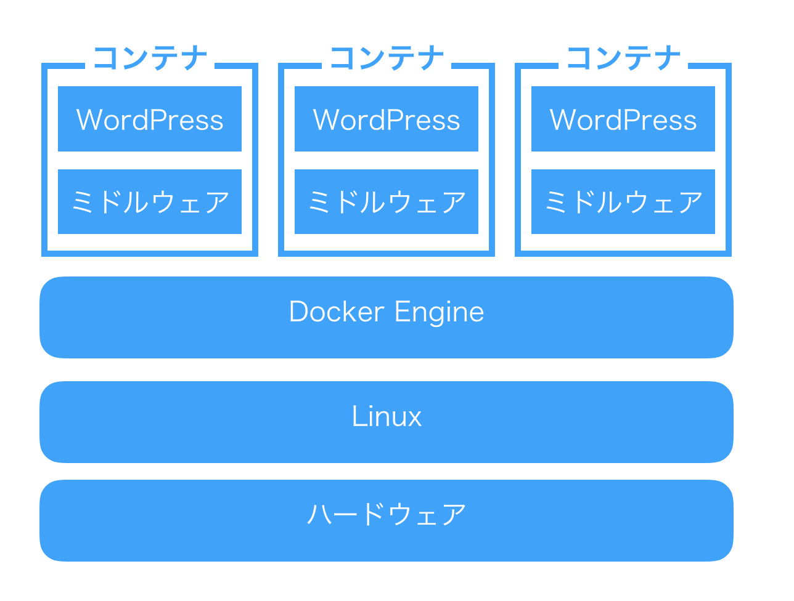

# 5章: Google Kubernetes Engineによる大規模編成

本章ではKubernetesを利用した大規模編成について紹介する。大注目のクラウド技術であり、なおかつAWSから[GCPへの移行を決断した企業](https://capitalp.jp/2018/01/24/pantheon-moves-to-gcp/)の目当てがこのKubernetesだったりするので、ぜひともチェックしておきたいところだ。

では、実際に作業に取りかかるまえに、そもそもKubenetesとはなんなのか、ということを知っておこう。

## DockerとKubernetes

さて、Kubernetes（クーバーネティスと発音するらしい）を学ぶ前に、[Docker](https://www.docker.com)について説明しておきたい。Dockerは仮想化技術の一つである。仮想化技術には色々あるが、そのそもそも意図していたところから振り返ってみよう。

そもそも仮想化技術が必要とされたのは、あるアプリケーションの移動および複製を容易にするためである。この問題に対する解決策はこれまでいくつか提示されてきており、たとえばJava（どのOSでも動く！）やFlash（ほとんどのOSで動いた！）などもその一つだ。

2013年に誕生したDockerの何が優れていたかを知る前に、Dockerが何に対するソリューションだったのかを知っておくとわかりやすいだろう。そう、Dockerは[VirtualBox](https://www.virtualbox.org)の進化版なのである。

Docker以前の仮想化技術では、ハイパーバイザ型やホスト型と言われる仮想化技術が主流だった。VirtualBoxやVMWareなどを使ってMac上でWindowsを走らせたことがある方はご存知だと思うが、これは重たい処理であった。

もちろん、「1台のハードで複数のOSを使いたい」といった類の要望に対してはいまでもこれがベストソリューションであるが、Webサイト運用の現場ではサイトの複製や冗長化などの要望が強く、AWS EC2やGCPのCompute Engineにおいても繰り返しOSのインストールをする煩わしさがある。マシンイメージを残すことである程度の簡便さはもたらされるが、まったく同じ数GBのOSが何度もインストールされるのは巨視的な視点で見ると完全な無駄である。

そうした状況に颯爽と現れたDockerは、よりシンプルな「コンテナ」という概念をもたらした。コンテナとハイパーバイザ・ホスト型との違いを図示すると、次の図になる。

コンテナにおいては、OS（Linuxカーネルといってしまっていいだろう）は共有される。コンテナの作成もDockerではDockerfileと呼ばれるレシピファイルを元に作成することができ、自動かもたやすい。こうしてDockerは仮想化技術の新しいスタンダードとして名乗りを挙げたのである。

そんなDockerが普及するにつれ、当然ながらWebサイトを運営する人々はこのDockerを管理するツールの必要性を感じるようになった。具体的にはこんな要望である。

- サイトのトラフィックに応じてコンテナの数を自動的に増減させたい。
- 障害があったら自動的に復旧してほしい。
- デプロイを自動化し、新機能の部分的な適用やフォールバックなどを行いたい。