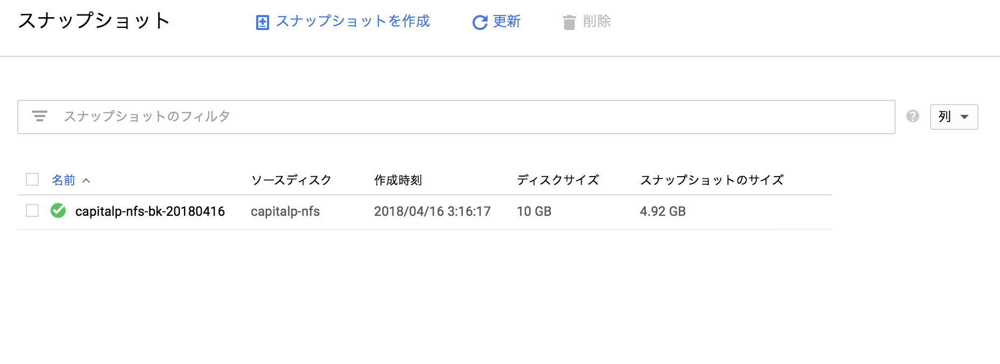
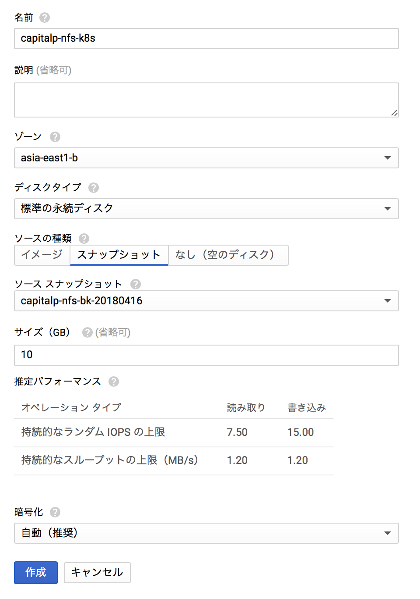
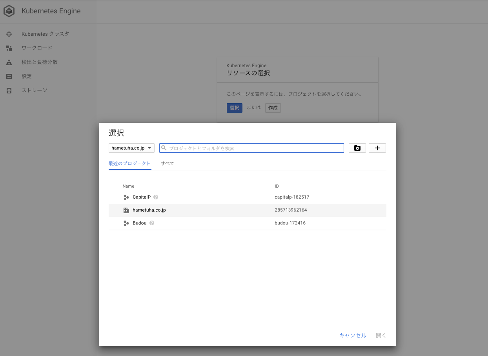
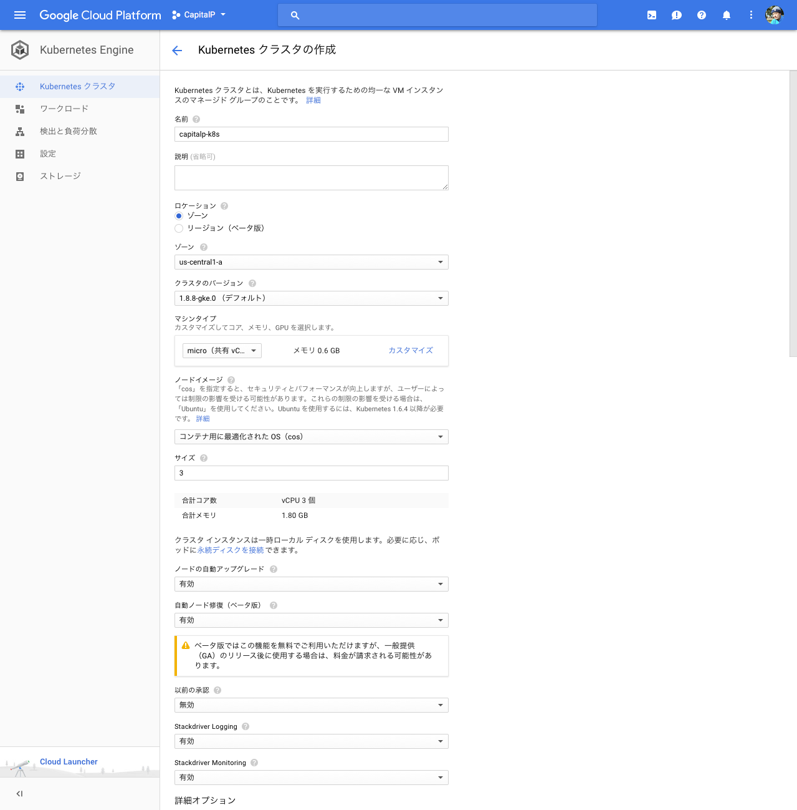
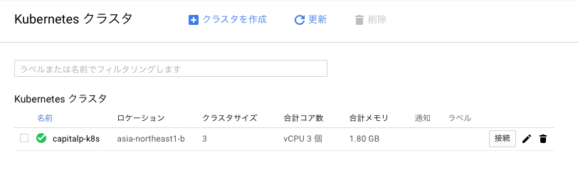
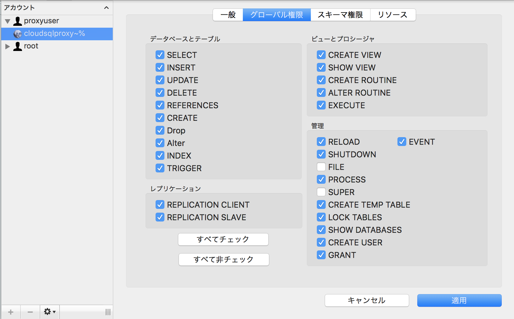
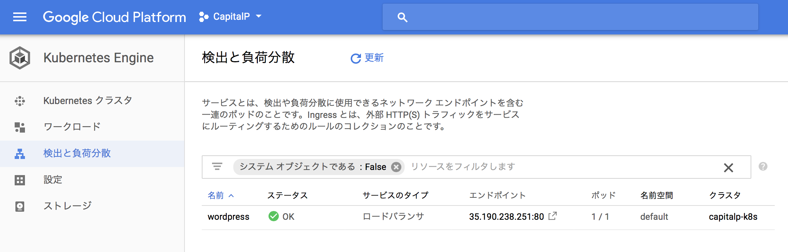
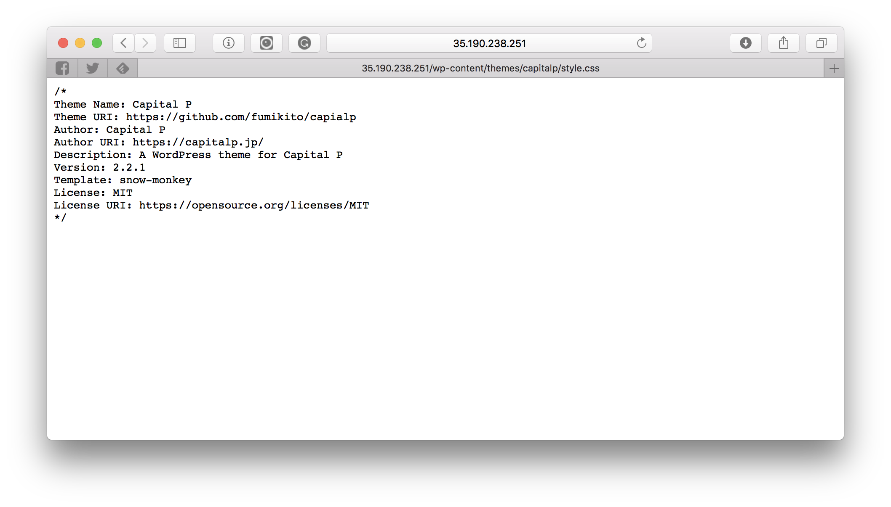

# 5章: Google Kubernetes Engineによる大規模編成

本章ではKubernetesを利用した大規模編成について紹介する。大注目のクラウド技術であり、なおかつAWSから[GCPへの移行を決断した企業](https://capitalp.jp/2018/01/24/pantheon-moves-to-gcp/)の目当てがこのKubernetesだったりするので、ぜひともチェックしておきたいところだ。

では、実際に作業に取りかかるまえに、そもそもKubenetesとはなんなのか、ということを知っておこう。

## DockerとKubernetes

さて、Kubernetes（クーバーネティスと発音するらしい）を学ぶ前に、[Docker](https://www.docker.com)について説明しておきたい。Dockerは仮想化技術の一つである。仮想化技術には色々あるが、そのそもそも意図していたところから振り返ってみよう。

そもそも仮想化技術が必要とされたのは、あるアプリケーションの移動および複製を容易にするためである。この問題に対する解決策はこれまでいくつか提示されてきており、たとえばJava（どのOSでも動く！）やFlash（ほとんどのOSで動いた！）などもその一つだ。

2013年に誕生したDockerの何が優れていたかを知る前に、Dockerが何に対するソリューションだったのかを知っておくとわかりやすいだろう。そう、Dockerは[VirtualBox](https://www.virtualbox.org)の進化版なのである。

Docker以前の仮想化技術では、ハイパーバイザ型やホスト型と言われる仮想化技術が主流だった。VirtualBoxやVMWareなどを使ってMac上でWindowsを走らせたことがある方はご存知だと思うが、これは重たい処理であった。


もちろん、「1台のハードで複数のOSを使いたい」といった類の要望に対してはいまでもこれがベストソリューションであるが、Webサイト運用の現場ではサイトの複製や冗長化などの要望が強く、AWS EC2やGCPのCompute Engineにおいても繰り返しOSのインストールをする煩わしさがある。マシンイメージを残すことである程度の簡便さはもたらされるが、まったく同じ数GBのOSが何度もインストールされるのは巨視的な視点で見ると完全な無駄である。

そうした状況に颯爽と現れたDockerは、よりシンプルな「コンテナ」という概念をもたらした。コンテナとハイパーバイザ・ホスト型との違いを図示すると、次の図になる。


コンテナにおいては、OS（Linuxカーネルといってしまっていいだろう）は共有される。コンテナの作成もDockerではDockerfileと呼ばれるレシピファイルを元に作成することができ、自動かもたやすい。こうしてDockerは仮想化技術の新しいスタンダードとして名乗りを挙げたのである。

そんなDockerが普及するにつれ、当然ながらWebサイトを運営する人々はこのDockerを管理するツールの必要性を感じるようになった。具体的にはこんな要望である。

- サイトのトラフィックに応じてコンテナの数を自動的に増減させたい。
- 障害があったら自動的に復旧してほしい。
- デプロイを自動化し、新機能の部分的な適用やフォールバックなどを行いたい。

そこで登場したのがKubernetesである。Kubernetesは「オーケストレーション・ツール」と呼ばれることがあるように、様々な楽器を取り揃えたオーケストラを率いる指揮者さながら、各コンテナを管理するツールである。とりわけ、コンテナ間の通信などのDockerで面倒だと思われていたケースにおいて力を発揮するようだ。要するに、大規模な構成においてDockerで面倒だと思われていた部分をいい感じになんとかしてくれる、それがKubernetesであるらしい。

そんなことを言われても……と読者であるあなたが訝るのも無理はない。というのも、筆者もまた、現時点でKubernetesを一度も触ったことがないからだ。それでは前段はこれぐらいにして、実際にCapital Pをスケールアウト可能な分散型環境に展開してみよう。

## 構成およびツールの確認

さて、それではKubernetes（以下、k8s）でなにをすればいいのかを確認しよう。

まずは用語の確認から。

|用語|説明|
|----|----|
|マスター|ノードを制御するマシン。すべての親だと思えば良さそう。|
|ノード|タスクを実行するマシン。|
|Pod|いくつかのコンテナをまとめたグループのこと。ノードにデプロイされる。|
|サービス|Podに対する作業の指示|

### 設定ファイル

さて、これからなにをしなければいけないかというと、設定ファイルの作成である。k8sでは、すべてのPodが使い捨てであり、それらはYAMLファイルを元に構築される。どのPodが死んで、どのように再作成されるのかはあまり意識する必要がない。設定ファイルの例は以下。

```
apiVersion: v1
kind: Service
metadata:
  labels:
    app: wordpress
  name: wordpress
spec:
  type: LoadBalancer
  ports:
    - port: 80
      targetPort: 80
      protocol: TCP
  selector:
    app: wordpress
```

この設定ファイルの`kind`という部分で、この設定ファイルがなにをするものなのかを定義しているようだ。今回の場合、MySQLと永続ディスクは第3章ですでに作成済みなので、WordPressが動作するPodと、それらのPodにアクセスを分散するサービスを作成する必要がある。

### ツール

ツールには主に2種類ある。1つ目は`gcloud`コマンドで実行されるGoogle Cloud SDKだ。こちらは前章で説明済みである。もう1つ、k8sをコントロールするための`kubectl`が必要だ。これは`gcloud`コマンドを利用してインストールすることができる。

```
gcloud components install kubectl
```

また、Google Kubernetes Engineを利用するためには課金を有効にする必要があるので、まだの人は第3章を参考にしていただきたい。

それでは準備完了だ。いよいよ実践編に入ろう。

### スナップショットの作成

さて、GCEですでに利用されている永続ディスクをk8sのクラスタにアタッチすることはできないようなので、第3章で作成したディスクをコピーしよう。まずはスナップショットを作成する。



続いて、そのスナップショットを元に新たな永続ディスクを作成する。新しい名前は`capitalp-nfs-k8s`としておこう。



これで準備完了だ。

## Kubernetesクラスタの作成

まずはクラスタを作成する必要がある。[Kubernetes Engineのページ](https://console.cloud.google.com/projectselector/kubernetes?hl=ja)へ移動し、プロジェクトを選択しよう。今回は第3章で作成した`CapitalP`プロジェクトを利用する。



さて、プロジェクトを紐づけたら、早速基本設定を行う。設定項目は次の通り。



変更したのは次の点である。

- ロケーションは第3章での設定にあわせ、`asia-northeast1-b`とする。
- マシンタイプは一番安い`micro`。ノード数は3以下にできないようなので、最小の3とする。
- 自動ノード修復をオンにする。おそらくだが、ノードが壊れた時に勝手に治るのだろう。なにをもって「壊れた」と定義するのかは謎だが、便利そうな機能ではある。
- 自動スケーリングをオンにする。最小と最大を選ぶことができるので、たぶんアクセス数が増大すると、勝手にノードを増やしてくれるのではないだろうか。今回は最小3で最大を10とした。
- ノードあたりのブートディスクサイズは10GBもあれば十分だろう。



それではいよいよクラスタの設定を開始しよう。以降はコマンドラインツールでの処理が必須となる。まずは作業ディレクトリとして、ローカル・マシーン（筆者の場合はMacbook）に作業用ディレクトリを設定しよう。ローカルでの作業は基本的に`~/Documents/GCP/capitalp`で行うこととする。

```
mkdir -p ~/Documents/GCP/capitalp
cd ~/Documents/GCP/capitalp
# これ以降はこのディレクトリでの作業。
```

## クラスタの設定

まずはプロジェクトを操作するために、`gcloud`コマンドの設定をしよう。基本的にはクラスタを操作するので、簡略化のために`gcloud`コマンドのデフォルト値を設定する。対象はプロジェクトID（プロジェクト一覧に表示されている）とゾーン。本来は`--project=capitalp-182517`といった具合に入力しなければならないが、簡略化のために設定しておく。もちろん、複数プロジェクトを管理する場合はこの限りではない。これらの情報のいくつかは公式チュートリアルに記載されていなかったが、`kubectl`を利用する時にエラーが発生するので、ブログ[DRYな備忘録](http://otiai10.hatenablog.com/entry/2016/04/07/061601)などを参考にしてほしい。

```
# プロジェクトCapital Pをデフォルトに
gcloud config set project capitalp-182517
# おなじく、ゾーンも
gcloud config set compute/zone asia-northeast1-b
# クラスタのデフォルトを設定
gcloud config set container/cluster capitalp-k8s
# 鍵情報を取得（よくわからない）
gcloud container clusters get-credentials capitalp-k8s
```

それでは、早速マニフェストファイルの作成をしよう。k8sの運用においては、レシピファイルをローカルで作成し、それをコマンドラインツールを通じてGCPに送りつける形をとる。まずはWordPressを動かすPHPサーバーのレシピ`wordpress.yaml`から作成しよう。

```
apiVersion: extensions/v1beta1
kind: Deployment
metadata:
  name: wordpress
  labels:
    app: wordpress
spec:
  replicas: 1
  selector:
    matchLabels:
      app: wordpress
  template:
    metadata:
      labels:
        app: wordpress
    spec:
      containers:
        - image: wordpress
          name: wordpress
          env:
          - name: WORDPRESS_DB_HOST
            value: 127.0.0.1:3306
          - name: WORDPRESS_DB_PASSWORD
            value: **************
          ports:
            - containerPort: 80
              name: wordpress
          volumeMounts:
            - name: wordpress-persistent-storage
              mountPath: /var/www/html
      volumes:
        - name: wordpress-persistent-storage
          gcePersistentDisk:
            pdName: capitalp-nfs-k8s
            fsType: ext4
```

これらのファイルは基本的に[公式チュートリアル](https://cloud.google.com/kubernetes-engine/docs/tutorials/persistent-disk?hl=ja)を参考にしたものだが、以下の点で異なっている。

- 永続ディスク`spec > template > spec > volumes > gcePersistentDisk > pdName`は先ほど作成した`capitalp-nfs-k8s`を指定。
- `spec > template > spec > containers > volumeMounts > mountPaht`は同じく第3章で作成した`/var/www/wordpress`と異なるが、これは決め打ちらしい。

さて、これで基本的には問題ないはずなのだが、まだMySQLの接続情報を指定する必要がある。公式チュートリアルではWordPress（PHPサーバー）とMySQLの2種類のPodを作成していたが、今回はCloud SQLを利用するのでMySQLのPodは必要ない。しかし、Cloud SQLに繋げるには第3章で紹介した通り、[cloud_sql_proxyを利用](https://cloud.google.com/sql/docs/mysql/connect-container-engine?hl=ja)しなければならない。Google Compute Engineで接続するときとは少し勝手が違うようだ。

まずは、cloud_sql_proxy経由で接続する専用のMySQLユーザーを作る必要があるらしい。そのためのコマンドは次の通り。`gcloud`コマンドから作成する。

```
gcloud sql users create proxyuser cloudsqlproxy~% --instance=capitalp-db-master
```

本当にユーザーが作成されたのかどうか、Sequel Proで表示してみよう。以前やったとおり、ローカル・マシーンからCloud SQLに接続する方法は次の通り。

```
# 第3章で作成した、cloud_sql_proxyのディレクトリがあるホームディレクトリへ移動。
cd ~
# 接続開始。
cloud_sql_proxy -dir=.cloud_sql_proxy -instances=capitalp-182517:asia-northeast1:capitalp-db-master -credential_file=.ssh/google/capitalp-ce01.json
```



今回の場合、インスタンス接続名は`capitalp-182517:asia-northeast1:capitalp-db-master`である。もしわからない場合は次のコマンドで取得すること。

```
gcloud sql instances describe capitalp-db-master
```

基本的には`プロジェクトID:ゾーン名:インスタンスID`となっているらしい。続いて、第3章で作成したサービスアカウントの鍵情報を用いて、PodからCloud SQLに接続できるようなシークレット`cloudsql-db-credentials`を作成する必要がある。

```
# ホームディレクトリに移動
cd ~
kubectl create secret generic cloudsql-instance-credentials --from-file=credentials.json=.ssh/google/capitalp-ce01.json
# -> secret "cloudsql-instance-credentials" created
# proxyuserをのためのシークレットを作成する
kubectl create secret generic cloudsql-db-credentials --from-literal=username=proxyuser
# -> secret "cloudsql-db-credentials" created
```

これでシークレット（たぶんJSONみたいなもの）が作成されたので、先ほどの`wordpress.yaml`の接続情報を次のように変更する。ポイントとしては、データベース接続情報のパスワード`WORDPRESS_DB_PASSWORD`が空になっていることだ。本当かどうかはわからないが、そもそもProxyを経由しないとCloud SQLに接続できないので、パスワードを設定しなくてもいいとのこと。

それでは、`wordpress.yaml`を次のように編集しよう。実際に再びホームディレクトリから作業ディレクトリ`~/Documents/GCP/capitalp`まで移動することを忘れないように。

```
apiVersion: extensions/v1beta1
kind: Deployment
metadata:
  name: wordpress
  labels:
    app: wordpress
spec:
  replicas: 1
  selector:
    matchLabels:
      app: wordpress
  template:
    metadata:
      labels:
        app: wordpress
    spec:
      containers:
        - image: wordpress
          name: wordpress
          env:
            - name: WORDPRESS_DB_HOST
              value: 127.0.0.1:3306
            - name: WORDPRESS_DB_USER
              valueFrom:
                secretKeyRef:
                  name: cloudsql-db-credentials
                  key: username
            - name: WORDPRESS_DB_PASSWORD
              value: ''
          ports:
            - containerPort: 80
              name: wordpress
          volumeMounts:
            - name: wordpress-persistent-storage
              mountPath: /var/www/html
        - name: cloudsql-proxy
          image: gcr.io/cloudsql-docker/gce-proxy:1.11
          command: ["/cloud_sql_proxy",
                    "-instances=capitalp-182517:asia-northeast1:capitalp-db-master=tcp:3306",
                    "-credential_file=/secrets/cloudsql/credentials.json"]
          volumeMounts:
            - name: cloudsql-instance-credentials
              mountPath: /secrets/cloudsql
              readOnly: true
      volumes:
        - name: wordpress-persistent-storage
          gcePersistentDisk:
            pdName: capitalp-nfs-k8s
            fsType: ext4
        - name: cloudsql-instance-credentials
          secret:
            secretName: cloudsql-instance-credentials
```

それでは、上記ファイルをデプロイしよう。デプロイメントは非常に簡単で、コマンド一発のようだ。

```
kubectl create -f wordpress.yaml
# -> deployment "wordpress" created
```

続いて、Podが動作しているのかを確認する。準備ができるまで数分かかるらしいので、気長に待とう。

```
kubectl get pod -l app=wordpress
```

間違いがあった場合は、コンソールの`Kubernets Engine > ワークロード > wordpress > YAML`と移動すると、YAMLを直接編集することができる。

## プロジェクトの公開

さて、これで3台のノードがWordPressを密かに動かしている状態なわけだが、これをどのようにして公開したらよいのか？

そのためにはロードバランサ（有料）をサービスとして登録し、それぞれのPodに紐づける必要がある。ローカルの`~/Documents/GCP/capitalp`まで移動し、新たな設定ファイル`wordpress-service.yaml`を作成しよう。

```
apiVersion: v1
kind: Service
metadata:
  labels:
    app: wordpress
  name: wordpress
spec:
  type: LoadBalancer
  ports:
    - port: 80
      targetPort: 80
      protocol: TCP
  selector:
    app: wordpress
```

それでは、この設定をデプロイする。コマンドは次の通り。

```
kubectl create -f wordpress-service.yaml
# -> service "wordpress" created
```



IPアドレスが表示されているので、実際にアクセスしてみよう。トップページにアクセスすると、WordPressの機能によってカノニカルURLにリダイレクトされてしまうので、Capital Pに固有のテーマcapitalpのスタイルシートにアクセスする。



実際に公開するとなると、第3章で行ったように、DNSを振り向ける必要がある。だが、GCPのロードバランサーが優れている点として、[エニーキャストIP](https://cloud.google.com/load-balancing/?hl=ja)という仕組みにより、単一のIPアドレスで終端できる点をあげられる。これはAWSのロードバランシングにはなかった利点で、ルートドメイン（`www.capitalp.jp`ではなく、`capitalp.jp`）のようにCNAMEを利用することができないドメインでも、特に意識することなくDNS設定を行うことができる。

## その他のタスク

さて、実際にk8s環境で運用するとなると、他にやるべきこといくつかある。ざっと挙げてみよう。

### デプロイメント

Webサイトを運営する以上、当然ながらファイルはデプロイすることができなくてはならない。一番手っ取り早いのは、WordPressのルートディレクトリである永続ディスク`capitalp-nfs-k8s`にSSH鍵を付与し、アップロードすることだろう。

Gitなどで管理している場合、デプロイ専用のノードを用意するなど、一工夫必要になってくるかもしれない。

### CRONの処理

Caiptal PではWordPressに必須の処理`WP_CRON`を[外部コマンドで行っている](https://capitalp.jp/2018/02/10/best-practice-of-batch-processing-in-wp/)のだが、クラスタ内の特定のノードにだけCron処理を行わせるためにどうしたらよいのかについても検討する必要があるだろう。

### 固定IP

それぞれのノードがどのような固定IPを持つのかについても検討が必要だ。日本のレガシーなサービスでは、特定のIPからのアクセスに対してしかサービスを提供しないことがあるので、そうしたサービスがクリティカルな場合、調査すべきことはいくつかありそうだ。

## まとめ

筆者の感想としては、**慣れてしまえばそれほど難しくない**という一語に尽きる。k8sを利用する最大のメリットは、コンテナ技術による水平展開だろう。

負荷分散に関しては、正直なところGCEでも似たようなことはできるし、そもそもAWSにも同等の機能は存在する。Amimotoに代表されるAMI(Amazon Machine Image)のような知見が豊富にあることを考えると、もしかしたらAWSの方が簡単かもしれない。

しかし、`gcloud`に代表されるSDKとREST可能な管理画面操作は、ホスティングなどの「大量の人にWordPress環境を提供するビジネス」を考えている人には大いなるメリットをもたらすだろう。AWSよりもシンプルな構成もビジネスの発展を加速してくれる一因となるはずだ。
